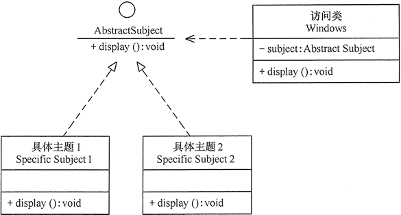

### Design Patterns

- 设计模式的本质是面向对象设计原则的实际运用，是对类的封装性、继承性和多态性以及类的关联关系和组合关系的充分理解。

| 范围\目的 | 创建型模式                   | 结构型模式                                        | 行为型模式                                                   |
| --------- | ---------------------------- | ------------------------------------------------- | ------------------------------------------------------------ |
| 类模式    | 工厂方法                     | (类）适配器                                       | 模板方法、解释器                                             |
| 对象模式  | 单例  原型  抽象工厂  建造者 | 代理  (对象）适配器  桥接  装饰  外观  享元  组合 | 策略  命令  职责链  状态  观察者  中介者  迭代器  访问者  备忘录 |

> 23 种设计模式不是孤立存在的，很多模式之间存在一定的关联关系

- 七个原则

  - 开闭原则(Open Closed Principle， OCP) --- ***终极原则***

    软件实体应该对**扩展开放** **对修改关闭** 。当应用的需求改变时，在不修改软件实体的源代码或者二进制代码的前提下，可以扩展模块的功能，使其满足新的需求。

    ***作用***: 1) 软件测试(只对扩展的代码进行测试) 2) 提高代码的可复用性(粒度越小 被复用的可能性就越大) 3) 提高软件的可维护性

    ***方法***:  “抽象约束 封装变化”

  

  

  - 里氏替换原则(Liskov Substitution Principle, LSP)

    继承必须确保***超类***所拥有的性质在***子类***中仍然成立

    ***作用:*** 1) 实现**开闭原则**的重要方式之一 2) 克服了重写父类造成的**可复用性变差**的特点 3) 动作**正确性**的保证

    ***方法:*** 子类**可以扩展**父类的功能，但**不能改变**父类原有的功能 

    如果违背了李氏替换原则 那么继承类的对象在基类出现的地方会出现于运行错误 此时应该重新设计他们的关系

    "正方形不是长方形"

    “几维鸟不是鸟”

  

  ```java
  package principle;
  public class LSPtest
  {
      public static void main(String[] args)
      {
          Bird bird1=new Swallow();
          Bird bird2=new BrownKiwi();
          bird1.setSpeed(120);
          bird2.setSpeed(120);
          System.out.println("如果飞行300公里：");
          try
          {
              System.out.println("燕子将飞行"+bird1.getFlyTime(300)+"小时.");
              System.out.println("几维鸟将飞行"+bird2.getFlyTime(300)+"小时。");
          }
          catch(Exception err)
          {
              System.out.println("发生错误了!");
          }
      }
  }
  //鸟类
  class Bird
  {
      double flySpeed;
      public void setSpeed(double speed)
      {
          flySpeed=speed;
      }
      public double getFlyTime(double distance)
      {
          return(distance/flySpeed);
      }
  }
  //燕子类
  class Swallow extends Bird{}
  //几维鸟类
  class BrownKiwi extends Bird
  {
      public void setSpeed(double speed)
      {
             flySpeed=0;
      }
  }
  ```

  ​		“几维鸟是鸟”

  > 程序运行错误的原因是：几维鸟类重写了鸟类的 setSpeed(double speed)  方法，这**违背了**里氏替换原则。
  >
  > 正确的做法是：取消几维鸟原来的**继承关系**，定义鸟和几维鸟的**更一般**的父类，如**动物类**，它们都有奔跑的能力。几维鸟的飞行速度虽然为 0，但**奔跑速度**不为 0，可以计算出其奔跑 300 千米所要花费的时间。其类图如图所示。

  ​	

  

  - 依赖倒置原则(Dependence Inversion Principle, DIP)

    高层模块不应该依赖底层模块 两者都应该依赖其***抽象*** ,  抽象不应该依赖细节 细节应该依赖抽象。

    ***面向接口*** 编程 而不是面向实现编程 。实现开闭原则的重要途径之一，降低了客户与实现模块之间的耦合

    作用: 1) 降低类之间的耦合性 2) 提高系统的稳定性 3) 减少并行开发的风险 4) 提高代码的可读性和可维护性

    原则: 1) ***每个类*** 尽量提供接口或抽象类，或者两者都具备 2) ***变量*** 的声明类型尽量是接口或者是抽象类 3) 任何类都不应该从***具体类*** 派生 4) 使用继承时尽量遵循***里氏替换*** 原则

    方法: 

    “顾客购物程序”

    > 顾客**每更换**一家商店，都要修改一次代码，这明显违背了开闭原则。
    >
    > 存在以上缺点的原因是：顾客类设计时同具体的商店类**绑定了**，这违背了依赖倒置原则。
    >
    > 解决方法是：定义“婺源网店”和“韶关网店”的**共同接口 Shop**，顾客类面**向该接口编程**，其代码修改如下：

    ```java
    class Customer
    {
        public void shopping(Shop shop)
        {
            //购物
            System.out.println(shop.sell());
        }
    }
    ```

    

  

  - 单一职责原则(Single Responsibility Principle, SRP)

    规定一个类应该***有且仅有一个***引起它变化的原因 否则类应该被拆分(否则会削弱或者抑制这个类实现其他职责的能力 以及 造成冗余代码)

    作用:核心是控制类的粒度大小 将对象解耦 提高内聚 (单一职责同样也适用于方法， 一个方法应该尽可能做好一件事情。如果一个方法处理的事情太多，其颗粒度会变得很粗，不利于重用。)

    方法: 

    "大学学生工作管理程序"

    将学生工作类分为 生活辅导 和 学业指导

    

    

  - 接口隔离原则(Interface Segregation Principle, ISP)

    要求程序员尽量将臃肿庞大的接口拆分成更小的和更具体的接口，让接口中只包含客户感兴趣的方法。

    > 为各个类建立它们需要的专用接口，而不要试图去建立一个很庞大的接口供所有依赖它的类去调用。 

    作用:

    约束接口 降低对接口的依赖性

    方法:

    接口尽量小 但是要有限度 一个接口知服务于一个**子模块**或者**业务逻辑**

    例如: 将学生管理系统分成三个大的模块

    

  - 迪米特原则(Law Of Demeter , LOD)(又称做 最小知识原则(Least Knowledge Principle, LKP))

    "只与你的直接朋友交谈，不跟“陌生人”说话"

    如果两个软件实体无须直接通信，那么就不应当发生直接的相互调用，可以通过第三方转发该调用。其目的是降低类之间的耦合度，提高模块的相对独立性

    作用:

    降低了类之间的耦合度 提法了类的可复用率和系统的扩展性

    方法:

    明星与经纪人的关系

    

  - 合成复用原则（Composite Reuse Principle，CRP）（组合/聚合复用原则（Composition/Aggregate Reuse Principle，CARP))

    作用:

    在软件复用时，要尽量先使用组合或者聚合等关联关系来实现，其次才考虑使用继承关系来实现。 如果要使用继承关系，则必须严格遵循里氏替换原则。合成复用原则同里氏替换原则相辅相成的，两者都是开闭原则的具体实现规范。

    方法:

    

    使用合成复用原则

    


> 总结:
>
> 这 7 种设计原则是软件设计模式必须尽量遵循的原则，各种原则要求的侧重点不同。其中，开闭原则是总纲，它告诉我们要对扩展开放，对修改关闭；里氏替换原则告诉我们不要破坏继承体系；依赖倒置原则告诉我们要面向接口编程；单一职责原则告诉我们实现类要职责单一；接口隔离原则告诉我们在设计接口的时候要精简单一；迪米特法则告诉我们要降低耦合度；合成复用原则告诉我们要优先使用组合或者聚合关系复用，少用继承关系复用。


- 创建型模式的特点和分类

特点: 将对对象的创建与使用分离

分类: 

- 单例模式(Singleton)

  - 定义: 指一个类只有一个实例，且该类能自行创建这个实例的一种模式。(例如Windows的回收站只能打开一个窗口,避免出现多个窗口显示内容的不一致问题 多线程中的线程池)

  - 特点: 

  1. 单例类***只有一个***实例对象；
  2. 该单例对象必须由单例类***自行创建***；
  3. 单例类对外提供一个访问该单例的***全局访问点***；

  - 结构

    单例类：包含一个实例且能自行创建这个实例的类。

    访问类：使用单例的类。

  

  - 实现: 

    1. 懒汉式单例(类加载时没有生成单例，只有当第一次调用 getlnstance 方法时才去创建这个单例。)

       ```java
       public class LazySingleton
       {
           private static volatile LazySingleton instance=null;    //保证 instance 在所有线程中同步
           private LazySingleton(){}    //private 避免类在外部被实例化
           public static synchronized LazySingleton getInstance()
           {
               //getInstance 方法前加同步
               if(instance==null)
               {
                   instance=new LazySingleton();
               }
               return instance;
           }
       }
       ```

       缺点是 不可以删除volatile 和 synchronized 关键字 否则会产生线程不安全问题 每次访问都要同步会影响性能

    2. 饿汉式单例(类一旦加载就创建一个单例，保证在调用 ***getInstance 方法之前*** 单例已经存在了)

       ```java
       public class HungrySingleton
       {
           private static final HungrySingleton instance=new HungrySingleton();
           private HungrySingleton(){}
           public static HungrySingleton getInstance()
           {
               return instance;
           }
       }
       ```

  - 应用场景

    某类之要求神成一个对象的时候 班长 身份证号等

    共享场合可以节省内存加快对象访问速度 Web中的配置对象 数据库的连接池等

    当某类需要频繁实例化，而创建的对象又频繁被销毁的时候，如多线程的线程池、网络连接池等

    

- 原型模式(Prototype)

  - 定义: 用一个已经创建的实例作为原型，通过复制该原型对象来创建一个和原型相同或相似的新对象. (即Windows的复制, Java的clone()方法)

  - 结构: 

    

  - 实现

    原型模式的克隆分为浅克隆和深克隆，Java 中的 Object 类提供了浅克隆的 clone() 方法，具体原型类只要实现 Cloneable 接口就可实现对象的浅克隆，这里的 Cloneable 接口就是抽象原型类

    ```java
    //具体原型类
    class Realizetype implements Cloneable
    {
        Realizetype()
        {
            System.out.println("具体原型创建成功！");
        }
        public Object clone() throws CloneNotSupportedException
        {
            System.out.println("具体原型复制成功！");
            return (Realizetype)super.clone();
        }
    }
    //原型模式的测试类
    public class PrototypeTest
    {
        public static void main(String[] args)throws CloneNotSupportedException
        {
            Realizetype obj1=new Realizetype();
            Realizetype obj2=(Realizetype)obj1.clone();
            System.out.println("obj1==obj2?"+(obj1==obj2));
        }
    }
    
    
    ```

  - 应用场景:

    - 对象之间相同或相似，即只是个别的几个属性不同的时候。
    - 对象的创建过程比较麻烦，但复制比较简单的时候。


- 工厂方法模式(FactoryMethod)  

  - 定义: 定义一个创建产品对象的工厂接口，将产品对象的实际创建工作推迟到具体子工厂类当中。这满足创建型模式中所要求的“创建与使用相分离”的特点。

    把被创建的对象称为“产品”，把创建产品的对象称为“工厂”

  - 特点:

    - 用户只需要知道具体工厂的名称就可得到所要的产品，无须知道产品的具体创建过程；
    - 在系统增加新的产品时只需要添加具体产品类和对应的具体工厂类，无须对原工厂进行任何修改，满足开闭原则；
    - 但是, 每增加一个产品就要增加一个具体产品类和一个对应的具体工厂类，这增加了系统的复杂度。

  - 结构

    抽象工厂(Abstract Factory): 提供了创建产品的接口，调用者通过它访问具体工厂的工厂方法 newProduct() 来创建产品。

    具体工厂(ConcreteFactory): 主要是实现抽象工厂中的抽象方法，完成具体产品的创建。

    抽象产品(Product): 定义了产品的规范，描述了产品的主要特性和功能。

    具体产品(ConcreteProduct): 实现了抽象产品角色所定义的接口，由具体工厂来创建，它同具体工厂之间一一对应。

    

  - 实现

    ```JAVA
    package FactoryMethod;
    public class AbstractFactoryTest
    {
        public static void main(String[] args)
        {
            try
            {
                Product a;
                AbstractFactory af;
                af=(AbstractFactory) ReadXML1.getObject();
                a=af.newProduct();
                a.show();
            }
            catch(Exception e)
            {
                System.out.println(e.getMessage());
            }
        }
    }
    //抽象产品：提供了产品的接口
    interface Product
    {
        public void show();
    }
    //具体产品1：实现抽象产品中的抽象方法
    class ConcreteProduct1 implements Product
    {
        public void show()
        {
            System.out.println("具体产品1显示...");
        }
    }
    //具体产品2：实现抽象产品中的抽象方法
    class ConcreteProduct2 implements Product
    {
        public void show()
        {
            System.out.println("具体产品2显示...");
        }
    }
    //抽象工厂：提供了厂品的生成方法
    interface AbstractFactory
    {
        public Product newProduct();
    }
    //具体工厂1：实现了厂品的生成方法
    class ConcreteFactory1 implements AbstractFactory
    {
        public Product newProduct()
        {
            System.out.println("具体工厂1生成-->具体产品1...");
            return new ConcreteProduct1();
        }
    }
    //具体工厂2：实现了厂品的生成方法
    class ConcreteFactory2 implements AbstractFactory
    {
        public Product newProduct()
        {
            System.out.println("具体工厂2生成-->具体产品2...");
            return new ConcreteProduct2();
        }
    }
    ```

    XML

    ```XML
    <?xml version="1.0" encoding="UTF-8"?>
    <config>
    	<className>ConcreteFactory1</className>
    </config>
    ```

  - 应用场景

    工厂方法模式通常适用于以下场景。

    - 客户只知道创建产品的工厂名，而不知道具体的产品名。如 TCL 电视工厂、海信电视工厂等。
    - 创建对象的任务由多个具体子工厂中的某一个完成，而抽象工厂只提供创建产品的接口。
    - 客户不关心创建产品的细节，只关心产品的品牌。

  - 扩展

    当需要生成的产品不多且不会增加，一个具体工厂类就可以完成任务时，可删除抽象工厂类。这时工厂方法模式将退化到简单工厂模式，

    


- 抽象工厂模式(AbstractFactory)

  > 工厂方法模式考虑的只是某一类产品的生产。(例如: 汽车工厂值生产汽车 电视机工厂只生产电视机 都是同等级的产品)

  抽象工厂模式将考虑多等级产品的生产，将同一个具体工厂所生产的位于不同等级的一组产品称为一个产品族

  

  - 定义

    一种为访问类提供一个创建一组相关或相互依赖对象的接口，且访问类无须指定所要产品的具体类就能得到同族的不同等级的产品的模式结构。

    抽象工厂模式是工厂方法模式的升级版本，工厂方法模式只生产一个等级的产品，而抽象工厂模式可生产多个等级的产品。

  - 特点

    - 系统中有多个产品族，每个具体工厂创建同一族但属于不同等级结构的产品。
    - 系统一次只可能消费其中某一族产品，即同族的产品一起使用。
    - 可以在类的内部对产品族中相关联的多等级产品共同管理，而不必专门引入多个新的类来进行管理。
    - 当增加一个新的产品族时不需要修改原代码，满足开闭原则。
    - 当产品族中需要增加一个新的产品时, 所有的工厂类都需要进行修改

  - 结构

    抽象工厂（Abstract Factory）：提供了创建产品的接口，它包含***多个***创建产品的***方法*** newProduct()，可以创建***多个***不同等级的***产品***。***(和工厂方法模式不同)***

    具体工厂（Concrete Factory）：主要是实现抽象工厂中的多个抽象方法，完成具体产品的创建。

    抽象产品（Product）：定义了产品的规范，描述了产品的主要特性和功能，抽象工厂模式有多个抽象产品。

    具体产品（ConcreteProduct）：实现了抽象产品角色所定义的接口，由具体工厂来创建，它 同具体工厂之间是多对一的关系。

    

  - 实现

    抽象工厂: 提供了产品的生成方法

    ```java
    interface AbstractFactory
    {
        public Product1 newProduct1();
        public Product2 newProduct2();
    }
    ```

    具体工厂: 实现了产品的生成方法

    ```java
        class ConcreteFactory1 implements AbstractFactory
        {
            public Product1 newProduct1()
            {
                System.out.println("具体工厂 1 生成-->具体产品 11...");
                return new ConcreteProduct11();
            }
            public Product2 newProduct2()
            {
                System.out.println("具体工厂 1 生成-->具体产品 21...");
                return new ConcreteProduct21();
            }
        }
    ```

  - 应用场景

    创建属于不同操作系统的视窗构建 (如 Java 的 AWT 中的 Button 和 Text 等构件在 Windows 和 UNIX 中的本地实现是不同的。)

    1. 当需要创建的对象是一系列相互关联或相互依赖的产品族时，如电器工厂中的电视机、洗衣机、空调等。
    2. 系统中有多个产品族，但每次只使用其中的某一族产品。如有人只喜欢穿某一个品牌的衣服和鞋。
    3. 系统中提供了产品的类库，且所有产品的接口相同，客户端不依赖产品实例的创建细节和内部结构。

  - 扩展

    抽象工厂模式的扩展有一定的“开闭原则”倾斜性：

    1. 当增加一个新的产品族时只需增加一个新的具体工厂，不需要修改原代码，满足开闭原则。
    2. 当产品族中需要增加一个新种类的产品时，则所有的工厂类都需要进行修改，不满足开闭原则。


     另一方面，当系统中只存在一个等级结构的产品时，抽象工厂模式将退化到工厂方法模式。

  

- 建造者模式

  


- 结构型模式概述


