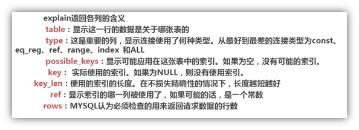

# 数据库高级部分

- 查看mysql编码 show variables like 'character%';
- 设置mysql编码 vi /etc/my.cnf 之后重启  service mysqld restart 

------

- A、/etc/my.cnf 这是mysql的主配置文件
- B、/var/lib/mysql mysql数据库的数据库文件存放位置
- C、/var/log/mysql数据库的日志输出存放位置
- D、查看端口 netstat -nltp 查看3306

------

- 数据模型
  - 数据结构
  - 数据操作
  - 数据约束条件
- 关系代数分类 
  - 基本运算: ***并 差 笛卡尔积 选择 投影***
  - 组合运算: ***叉 连接 自然连接 除***
  - 扩充的关系代数操作: ***外连接***

------

### 部分函数依赖：设X,Y是关系R的两个属性集合，存在X→Y，若X’是X的真子集，存在X’→Y，则称Y部分函数依赖于X。

```
举个例子：通过AB能得出C，通过A也能得出C，通过B也能得出C，那么说C部分依赖于AB。
```

#### 完全函数依赖：设X,Y是关系R的两个属性集合，X’是X的真子集，存在X→Y，但对每一个X’都有X’!→Y，则称Y完全函数依赖于X。

```
举个例子：通过AB能得出C，但是AB单独得不出C，那么说C完全依赖于AB.
```

#### 传递函数依赖：设X,Y,Z是关系R中互不相同的属性集合，存在X→Y(Y !→X),Y→Z，则称Z传递函数依赖于X。

```
举个例子：通过A得到B，通过B得到C，但是C得不到B，B得不到A，那么成C传递依赖于A
```

#### 三种范式

```
1 、第一范式（1NF）
在任何一个关系数据库中，第一范式（1NF）是对关系模式的基本要求，不满足第一范式（1NF）的数据库就不是关系数据库。
所谓第一范式（1NF）是指数据库表的每一列(即每个属性)都是不可分割的基本数据项，同一列中不能有多个值，即实体中的某个属性不能有多个值或者不能有重复的属性。
简而言之，第一范式就是无重复的列。
```

```
2、 第二范式（2NF）
第二范式（2NF）是在第一范式（1NF）的基础上建立起来的，即满足第二范式（2NF）必须先满足第一范式（1NF）。第二范式（2NF）要求数据库表中的每个实例或行必须可以被唯一地区分。为实现区分通常需要为表加上一个列，以存储各个实例的唯一标识。员工信息表中加上了员工编号（emp_id）列，因为每个员工的员工编号是唯一的，因此每个员工可以被唯一区分。这个唯一属性列被称为主关键字或主键、主码。
第二范式（2NF）要求实体的属性完全依赖于主关键字。所谓完全依赖是指不能存在仅依赖主关键字一部分的属性，如果存在，那么这个属性和主关键字的这一部分应该分离出来形成一个新的实体，新实体与原实体之间是一对多的关系。为实现区分通常需要为表加上一个列，以存储各个实例的唯一标识。
简而言之，第二范式就是非主属性依赖于主关键字。
```

```

3 、第三范式（3NF）
满足第三范式（3NF）必须先满足第二范式（2NF）。在满足第二范式的基础上，切不存在传递函数依赖，那么就是第三范式。简而言之，第三范式就是属性不依赖于其它非主属性。
```

#### 简而言之

#### 1、第一范式（1NF）：一个关系模式R的所有属性都是不可分的基本数据项。

#### 2、第二范式（2NF）：满足第一范式，然后消除部分依赖。

#### 3、第三范式（3NF）： 满足第二范式，消除传递依赖。

------

事务并发操作出现几种问题

事务: 是用户定义的一个***数据库操作序列***，是数据库环境中的***逻辑工作单元***,是一个***不可分割***的整体。

- 丢失修改数据
- 读“脏”数据
- 不一致分析

------

MySQL 慢查日志分析工具(mysqldumpslow)

MySQL 慢查日志分析工具(pt-query-digest)

- 安装 

  - wget https://www.percona.com/downloads/percona-toolkit/2.2.16/RPM/percona-toolkit-2.2.16-1.noarch.rpm && yum localinstall -y  percona-toolkit-2.2.16-1.noarch.rpm
  - pt-query-digest --help / pt-summary 检查是否安装成功

- 使用

  - 查看服务器信息 pt-summary

  - 查看磁盘开销使用信息 pt-diskstats

  - 查看mysql数据库信息 pt-mysql-summary --user=root --password=root

  - 分析慢查询日志 pt-query-digest /data/mysql/data/db-3-12-slow.log

  - 查找mysql的从库和同步状态 pt-slave-find --host=localhost --user=root --password=root

  - 查看mysql的死锁信息 pt-deadlock-logger --user=root --password=root localhost

  - 从慢查询日志中分析索引使用情况 pt-index-usage slow_20131009.log

  - 查找数据库表中重复的索引  pt-duplicate-key-checker --host=localhost --user=root --password=root

  - 查看mysql表和文件的当前活动IO开销 pt-ioprofile

  - 查看不同mysql配置文件的差异 pt-config-diff /etc/my.cnf /etc/my_master.cnf

  - pt-find查找mysql表和执行命令，示例如下

    ​	查找数据库里大于2G的表：

      pt-find --user=root  --password=123456 --tablesize +2G  

    ​	查找10天前创建，MyISAM引擎的表：

      pt-find --user=root  --password=123456 --ctime +10 --engine MyISAM  

    ​	查看表和索引大小并排序

      pt-find --user=root  --password=123456 --printf "%T\t%D.%N\n" | sort -rn  

  - pt-kill 杀掉符合标准的mysql进程

    ​	显示查询时间大于60秒的查询

      pt-kill --user=root  --password=123456 --busy-time 60 --print  

    ​	kill掉大于60秒的查询

       pt-kill --user=root  --password=123456 --busy-time 60 --kill  

  - 查看mysql授权

    ​	pt-show-grants --user=root --password=123456

    ​	pt-show-grants --user=root --password=123456 --separate –revoke

  - 验证数据库复制的完整性 pt-table-checksum --user=root --password=root

------

​	通过慢查日志发现有问题的SQL

- 查询次数多且每次查询占用时间长的sql pt-query-digest 查看前几项SQL执行次数 及占百分比等信息
- IO大的sql  Rows examine项。扫描的行数越多，IO越大。
- 未命中的索引的SQL  Rows examine 和Rows Send的对比

------

通过explain查询分析SQL的执行计划

explain select * from xxx  \G (\G 这种形式比较好看)

- id 列数字***越大越先执行*** id列为***null***的就表是这是一个***结果集***，不需要使用它来进行查询。
- select_type列
  - simple 
  - primary
  - union
- table 表名 若出现别名 则使用别名
- type
- possible
- key 用到的索引
- key_len 
- ref
- rows 估计的行数
- extra 其他信息
- filtered




------

具体慢查询优化案例

- max() 函数优化

  创建索引

- count() 函数优化

  错误方式: select count(release_year='2006' or release_year='2007') from film;(2006 和 2007分别是多少无法判断)

  正确方法: select count(release_year='2006' or null) as '06films',count(release_year='2007' or null) as '07films' from film;

  ```markdown
  区别count(*) 和 count(id)
  Count（id）是不包含null的值
  Count（*）是包含null的值
  ```

  


