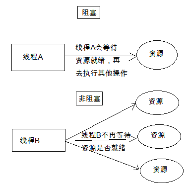
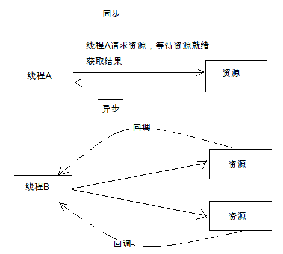
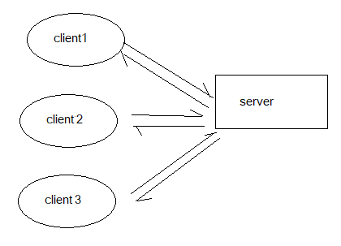
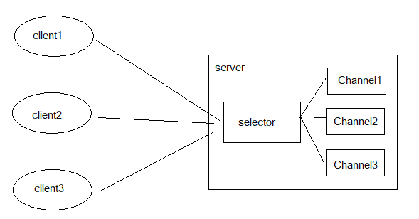
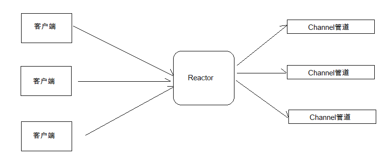
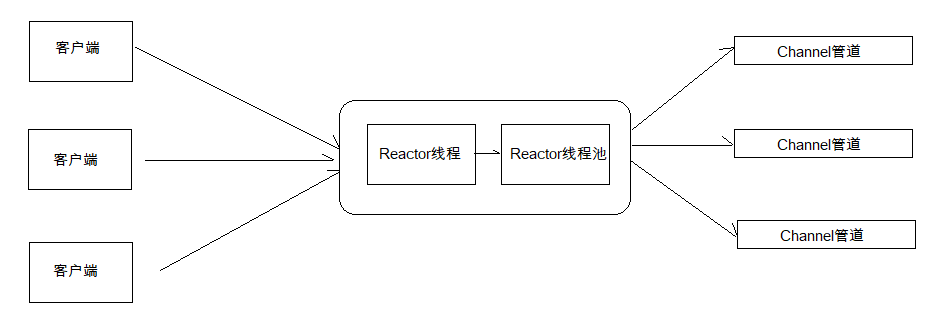
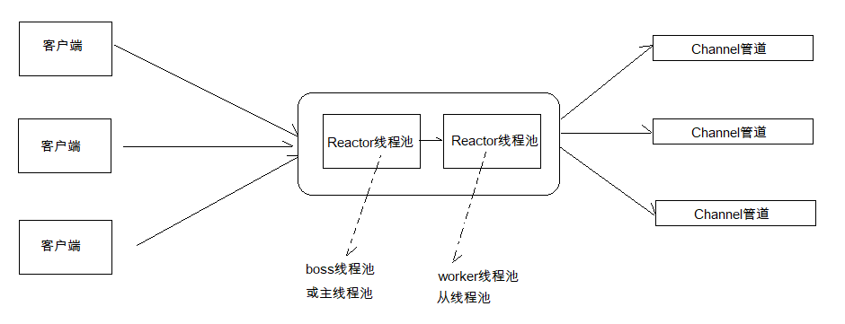

# 基于Netty的网络编程

### Netty

由JBOSS提供的Java开源框架 ,基于NIO的客户端服、服务器端编程框架 (Java Dubbo)

```markdown
NIO主要有三大核心部分：Channel(通道)，Buffer(缓冲区), Selector。传统IO基于字节流和字符流进行操作，而NIO基于Channel和Buffer(缓冲区)进行操作，数据总是从通道读取到缓冲区中，或者从缓冲区写入到通道中。Selector(选择区)用于监听多个通道的事件（比如：连接打开，数据到达）。因此，单个线程可以监听多个数据通道。
```

特点: 简单易用 基于事件驱动 吞吐量高

***BIO NIO AIO 简介和区别***

1. 阻塞与非阻塞




(银行只有一个窗口 银行有很多的窗口)

2. 同步和异步

   

   (TCP 和 UDP)

3. BIO
   ***同步阻塞*** IO , Block IO , IO 操作时会阻塞线程,并发处理能力低。
   我们熟知的 ***Socket 编程***就是 BIO ,一个 socket 连接一个处理线程(这个线程负责这个 Socket 连接的一系列数据传输操作)。

   阻塞的原因在于:操作系统允许的***线程数量是有限***的,***多个 socket*** 申请与服务端建立连接时,服务端不能提供***相应数量***的处理线程,没有分配到处理线程的连接就会***阻塞等待或被拒绝***。



4. NIO

   ***同步非阻塞*** IO None-Block IO, 基于***Reactor模型***.

   通常情况下,一个Sockect只在特定的时候才能发生数据传输IO操作(大部分这个"数据通道"时空闲的 但是还是***占着线程***)
   改进: ***"一个请求一个线程"*** 在连接到服务器的Socket中,只有在需要进行***IO操作***的时候才能获取服务端的***线程***

   

5. AIO (NIO 2.0)

   ***异步非阻塞*** IO Asynchronous IO  

   由***操作系统***先完成 ***客户端请求处理*** 再通知***服务器***去启动线程进行***处理***(从JDK1.7开始支持)


------

### Netty Reactor 模型 --- 单线程模型、多线程模型、主从多线程模型

1. 单线程模型

   用户***发起IO请求***到Reactor模型

   ***Reactor 线程***将用户的***IO请求***放入到***通道待处理***

   处理之后 Reactoe***重新获得线程的控制权*** 继续***对其他的线程***进行处理

   ```markdown
   这种模型一个时间点只有一个任务在执行,这个任务执行完了,再去执行下一个任务。
   1. 但单线程的 Reactor 模型每一个用户事件都在一个线程中执行:
   2. 性能有极限,不能处理成百上千的事件
   3. 当负荷达到一定程度时,性能将会下降
   4. 某一个事件处理器发生故障,不能继续处理其他事件
   ```

   

2. Reactor 多线程模型

   Reactor 多线程模型是由***一组NIO线程***来处理IO操作(之前是单个线程) 可以处理更多的客客户端请求

   使用***多个线程***执行***多个任务*** 任务可以***同时执行***

   

   如果并发量特别大的话 还是比较拉跨

3. Reactor ***主从***多线程模型

   Netty 推荐使用的模型 高并发

   一组***线程池***处理***接受请求***,s 一组***线程池***处理***IO***

   

------

### Netty - 基于WebSocket的聊天Demo

Code - 见Code

```xml
Maven
<dependencies>
	<dependency>
		<groupId>io.netty</groupId>
		<artifactId>netty-all</artifactId>
		<version>4.1.15.Final</version>
	</dependency>
</dependencies>
```