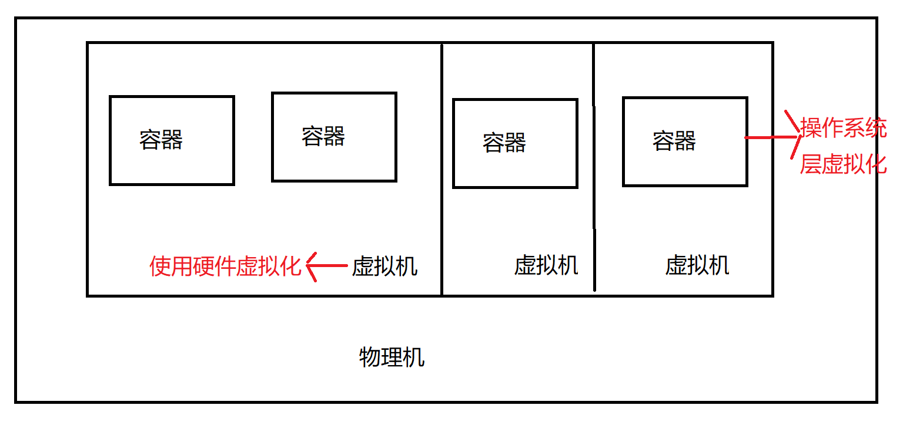
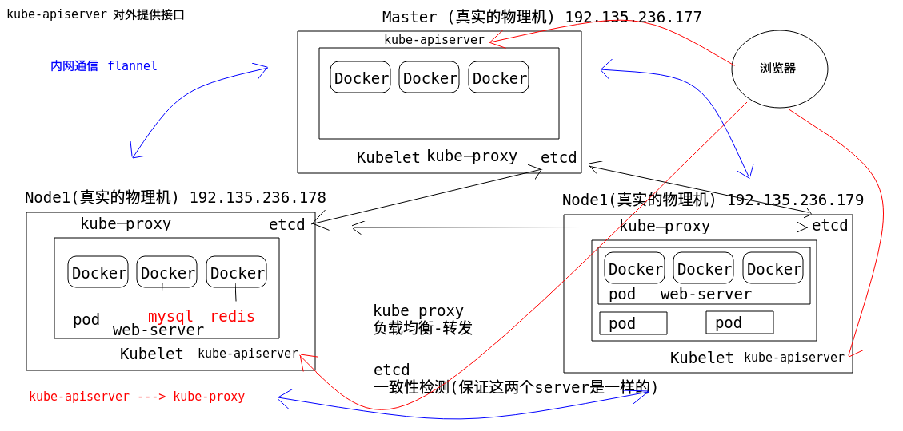
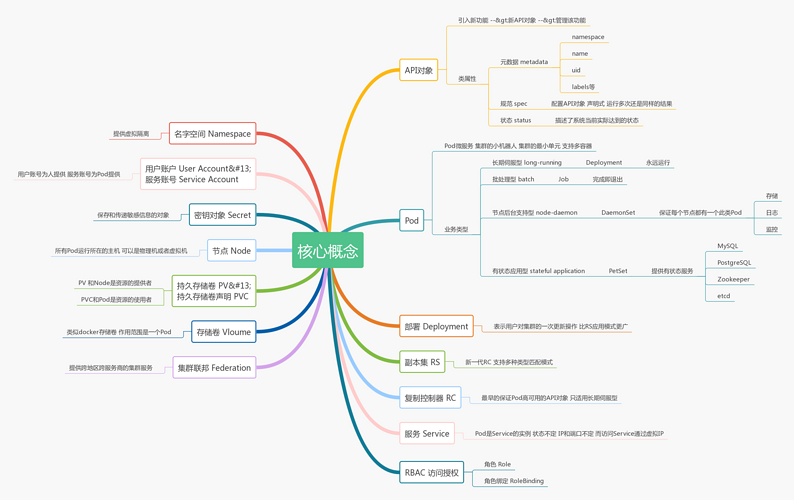

# Kubernetes

### 基本概念

用于管理众多的Docker(通信、负载均衡、资源共享管理、容 灾、监控、健康检查….)

### 环境

Ubuntu 18 + Docker(docker-ce 18 ce 的意思是社区版) + kuberbetes(k8s 1.13)

***Ubuntu*** 

##### 修改主机名

- 使用root登陆

- 修改主机名: vim /etc/cloud/cloud.cfg  
- 修改配置preserve_hostname: true

- 重启

##### 配置静态IP(永久有效) NAT 模式

- 使用root登陆

- vim /etc/netplan/50-cloud-init.yaml (以node2为例)

- ```
  network:
   ethernets:
   ens33:
   addresses: [192.168.236.177/24]
   dhcp4: false
   gateway4: 192.168.236.2
   nameservers:
   addresses: [192.168.236.2]
   optional: true
   version: 2 
  ```

  UbuntuMaster 172.16.235.146 

  UbuntuNode1 172.16.235.147 

  UbuntuNode2 172.16.235.148

##### 修改hosts

- 使用root登陆

- vim /etc/hosts 

  192.168.236.177 master

- 重启 shutdown -r now

##### ip应用启动

- $netplan apply

------

***Docker***

> Docker 是一个开源的应用**容器引擎**，是直接运行在宿主操作系统之上的一个容器，使用沙箱机制完全虚拟出一个完整的操作，容器之间不会有任何接口，从而让容器与宿主机之间、容器与容器之间隔离的更加彻底。每个容器会有自己的权限管理，独立的网络与存储栈，及自己的资源管理能，使同一台宿主机上可以友好的共存多个容器。

在一台宿主机上可以有多个容器



##### 配置国内源

***安装eurl***

```
apt-get update && apt-get install -y curl telnet
wget man \
apt-transport-https \
ca-certificates \
software-properties-common vim
```

***查看确认国内源***

```
$ cp /etc/apt/sources.list /etc/apt/sources.list.bak
$ cat /etc/apt/sources.list
```

##### 手动安装Docke(离线安装)

- 下载 docker-ce_18.06.1\~ce\~3-0\~ubuntu_amd64.deb
- 放到 master 服务器 并切换用户
- dpkg -i docker-ce_18.06.1\~ce\~3- 0\~ubuntu_amd64.deb

>如果提示错误 dpkg: error: dpkg frontend is locked by another process
>
>说明已经有其他进程在使⽤dpkg安装程序 sudo rm /var/lib/dpkg/lock 即可。

>如果提示错误
>
>[sudo] password for xxx: Selecting previously unselected package docker-ce. (Reading database ... 100647 files and directories currently installed.) Preparing to unpack docker-ce_18.06.1~ce~3- 0~ubuntu_amd64.deb ... Unpacking docker-ce (18.06.1~ce~3-0~ubuntu) ... dpkg: dependency problems prevent configuration of docker-ce: docker-ce depends on libltdl7 (>= 2.4.6); however: Package libltdl7 is not installed. dpkg: error processing package docker-ce (-- install): dependency problems - leaving unconfigured Processing triggers for man-db (2.8.4-2) ... Processing triggers for systemd (239-7ubuntu10) ... Errors were encountered while processing: docker-ce
>
>说明当前docker-ce 依赖系统libltd17库，安装就可以了 $ apt-get install -y libltdl7

- 启动Docker-ce

  - 设置开机启动 

    ```shell
    sudo systemctl enable docker
    sudo systemctl start docker
    ```

  - 重启确认是否 已经运行

    sudo docker ps

- 可下载 Alpine 镜像试验一下 Docker
  
  - $ sudo docker run -it --rm alpine:latest sh 

##### 创建Docker用户组并添加当前用户 (master node1 node2)

- 创建并切换到master 将当前的普通股用户添加到docker用户组

  ```shell
  sudo groupadd docker
  sudo usermod -aG docker $USER
  exit
  ```

- 重新登陆master并查看

  ```shell
  docker ps
  
  CONTAINER ID 	IMAGE 	COMMAND 
  
  CREATED 		STATUS  PORTSs
  ```

即可。

##### 申请阿里云镜像加速器

- 在阿⾥云注册⾃⼰账户
- 找到容器镜像服务 -> 镜像中⼼—>镜像加速器
- 保存加速器地址

##### docker 配置国内镜像加速器 (为了下载镜像更快)

- ```shell
  vim /etc/docker/daemon.json
  {
   "registry-mirrors":
  ["https://xxxxx.mirror.aliyuncs.com"]
  }
  ```

- 重启docker服务

  重载所有修改过的配置文件 

  ```shell
  sudo systemctl daemon-reload
  ```

  重启docker 服务 

  ```shell
  sudo systemctl restart docker
  ```


------

### Kubernetes 环境安装与部署

***k8s安装环境准备***

##### 配置并安装国内源

- 创建配置文件 

  ```shell
  sudo touch /etc/apt/sources.list.d/kubernetes.list
  sudo chmod 666 /etc/apt/sources.list.d/kubernetes.list
  vim kubernetes.list
  deb http://mirrors.ustc.edu.cn/kubernetes/apt kubernetes-xenial main
  ```

- sudo apt update 更新操作系统源

  ```
  Error:
  The following signatures couldn't be verified
  because the public key is not available: NO_PUBKEY
  6A030B21BA07F4FB
  ```

  签名认证失败 需要重新生成 记住这个***6A030B21BA07F4FB*** 后8位BA07F4FB

- 添加认证key

  ```shell
  gpg --keyserver keyserver.ubuntu.com --recv-keys BA07F4FB
  ```

  出现OK

  ```shell
  gpg --export --armor BA07F4FB | sudo apt-key add -
  ```

  再次更新系统源

##### 禁用基础设施

- 禁止止防火火墙

  ```
  $ sudo ufw disable
  Firewall stopped and disabled on system startup
  ```

- 关闭swap

  ```
  # 成功
  $ sudo swapoff -a
  # 永久关闭swap分区
  $ sudo sed -i 's/.*swap.*/#&/' /etc/fstab
  ```

- 禁止止selinux

  ```
  # 安装操控selinux的命令
  $ sudo apt install -y selinux-utils
  # 禁止止selinux
  $ setenforce 0
  # 重启操作系统
  $ shutdown -r now
  # 查看selinux是否已经关闭
  $ sudo getenforce
  Disabled(表示已经关闭)
  ```

##### 系统网络设置

- 配置内核参数,将桥接的IPv4流量量传递到iptables的链

  创建 /etc/sysctl.d/k8s.conf 文件

  ```shell
  添加内容如下:
  net.bridge.bridge-nf-call-ip6tables = 1
  net.bridge.bridge-nf-call-iptables = 1
  vm.swappiness = 0
  ```

- 执行命令使修改生效

  ```
  # 【候选】建议执行行行下面面的命令
  $ sudo modprobe br_netfilter
  $ sudo sysctl -p /etc/sysctl.d/k8s.conf
  ```

##### 安装k8s

> 先要切换到 root 用户

- 安装Kubernetes 目目前安装版本 v1.13.1

```shell
$ apt update && apt-get install -y kubelet=1.13.1-00 kubernetes-cni=0.6.0-00 kubeadm=1.13.1-00 kubectl=1.13.1-00
```

- 设置开机启动

```shell
$ sudo systemctl enable kubelet && systemctl start
kubelet
$ sudo shutdown -r now
```

##### 验证

- 用root登陆
- kubectl get nodes
- kubectl version

------

### 创建企业Kubernetes多主机集群环境

##### 创建两个结点(两个虚拟机)

在VMware中克隆 分别命名为 UbuntuNode1 和 UbuntuNode2 并修改主机名和静态IP

1. 使用用root用用户登录
2. 打开配置文文件 vim /etc/cloud/cloud.cfg
3. 修改配置 preserve_hostname: true

4. 修改 /etc/hostname ,只有一行 node1 或 node2
5. 确认配置的三台机器的主机名称 cat /etc/hosts

##### 配置IP地址

***master***
/etc/netplan/50-cloud-init.yaml

```yaml
network:
	ethernets:
		ens33:
			addresses: [192.168.236.177/24]
			dhcp4: false
			gateway4: 192.168.236.2
			nameservers:
				addresses: [192.168.236.2]
			optional: true
	version: 2
```

重启ip配置

```
netplan apply
```

master: [192.168.236.177/24]

node1: [192.168.236.178/24]

node2: [192.168.236.179/24]

##### 修改hosts文件

vim /etc/hosts

```shell
192.168.236.177 master
192.168.236.178 node1
192.168.236.179 node2
```

shutdown -r now

##### 配置Master节点

- 创建工作目录

```
$ mkdir /home/itcast/working
$ cd /home/itcast/working/
```

- 创建kubeadm.conf配置文件

```
kubeadm config print init-defaults
ClusterConfiguration > kubeadm.conf
```

- 修改 kubeadm.conf

​	imageRepository
​	kubernetesVersion	

```shell
vi kubeadm.conf
# 修改 imageRepository: k8s.gcr.io
# 改为 registry.cn-beijing.aliyuncs.com/imcto
imageRepository: registry.cn-
beijing.aliyuncs.com/imcto
# 修改kubernetes版本kubernetesVersion: v1.13.0
# 改为kubernetesVersion: v1.13.1
kubernetesVersion: v1.13.1
```

- 修改 kubeadm.conf 中的API服务器地址,后面会频繁使用这个地址。

  ```
  localAPIEndpoint:
  	advertiseAddress: 192.168.236.177
  	bindPort: 6443
  ```

  > 注意: 192.168.236.177 是master主机的ip地址

- 配置子网网络

  ```
  networking:
  	dnsDomain: cluster.local
  	podSubnet: 10.244.0.0/16
  	serviceSubnet: 10.96.0.0/12
  scheduler: {}
  ```

  这里的 10.244.0.0/16 和 10.96.0.0/12 分别是k8s内部pods和services的子网络,最好使用这个地址,后续flannel网络需要用到。

##### 拉取K8s必备的模块镜像

查看一下都需要哪些镜像文件需要拉取

```
$ kubeadm config images list --config kubeadm.conf
registry.cn-beijing.aliyuncs.com/imcto/kube-
apiserver:v1.13.1
registry.cn-beijing.aliyuncs.com/imcto/kube-
controller-manager:v1.13.1
registry.cn-beijing.aliyuncs.com/imcto/kube-
scheduler:v1.13.1
registry.cn-beijing.aliyuncs.com/imcto/kube-
proxy:v1.13.1
registry.cn-beijing.aliyuncs.com/imcto/pause:3.1
registry.cn-beijing.aliyuncs.com/imcto/etcd:3.2.24
registry.cn-beijing.aliyuncs.com/imcto/coredns:1.2.6
```

拉取镜像

```
#下载全部当前版本的k8s所关联的镜像
kubeadm config images pull --config ./kubeadm.conf
```

##### 初始化kubernetes环境

```
#初始化并且启动
$ sudo kubeadm init --config ./kubeadm.conf
```

- ```
  $ mkdir -p $HOME/.kube
  $ sudo cp -i /etc/kubernetes/admin.conf
  $HOME/.kube/config
  $ sudo chown $(id -u):$(id -g) $HOME/.kube/config
  ```

- ```
  创建系统服务并启动
  # 启动kubelet 设置为开机自自启动
  $ sudo systemctl enable kubelet
  # 启动k8s服务程序
  $ sudo systemctl start kubelet
  ```

##### 验证kubernetes启动结果

验证输入,注意显示master状态是 NotReady ,证明初始化服务器器成功

```
$ kubectl get nodes
NAME 	STATUS 		ROLES 	AGE 	VERSION
master 	NotReady 	master 	12m 	v1.13.1
```

查看当前k8s集群状态

```shell
$ kubectl get cs
NAME	STATUS 	MESSAGE
ERROR
scheduler 			Healthy ok
controller-manager 	Healthy ok
etcd-0				Healthy {"health": "true"}
```

目目前只有一个master,还没有node,而且是NotReady状态,那么我们需要将node加入入到master管理理的集群中来。在加入之前,我们需要先配置k8s集群的内部通信网络,这里采用的是flannel网络

##### 部署集群内部通信flannel网络

```shell
$cd $HOME/working
$wget
https://raw.githubusercontent.com/coreos/flannel/a70459be0084506e4ec919aa1c114638878db11b/Documentation/
kube-flannel.yml
```

编辑这个文件,确保flannel网络是对的,找到 net-conf.json 标记的内容是否正确

```yaml
net-conf.json: |
	{
		"Network": "10.244.0.0/16",
		"Backend": {
		"Type": "vxlan"
	}
```

这个"10.244.0.0/16"和 ./kubeadm.conf中的podsubnet的地址要一致

应用当前flannel配置文件

```
xxx@master:~/working$ kubectl apply -f kube-flannel.yml
```

安装flannel网络后 执行 kubectl get nodes 输出结果如下

```
itcast@master:~/working$ kubectl get node
NAME 	STATUS 	ROLES 	AGE 	VERSION
master 	Ready 	master 	10m 	v1.13.1
```

此时master已经是 Ready 状态了了,表示已经配置成功了,那么我们就需要配置node来加入这个集群。

### 配置Node

##### 确认外部环境

1. 确认关闭swap

  ```
  apt install -y selinux-utils
  swapoff -a
  ```

2. 禁止止selinux

  ```
  setenforce 03. 确认关闭防火火墙
  ufw disable
  ```

3. 确认关闭防火火墙

  ```
  ufw disable
  ```

##### 配置k8s集群的Node主机环境

1. 启动k8s后台服务

   ```shell
   启动kubelet 设置为开机自自启动
   $ sudo systemctl enable kubelet
   启动k8s服务程序
   $ sudo systemctl start kubelet
   ```

2. 将master机器器的 /etc/kubernetes/admin.conf 传到到node1和node2

   登录 master 终端

   ```shell
   #将admin.conf传递给node1
   sudo scp /etc/kubernetes/admin.conf
   xxx@192.168.236.178:/home/xxx/
   #将admin.conf传递给node2
   sudo scp /etc/kubernetes/admin.conf
   xxx@192.168.236.179:/home/xxx/
   ```

3. 登录 node1 终端,创建基础kube配置文文件环境

  ```shell
  $ mkdir -p $HOME/.kube
  $ sudo cp -i $HOME/admin.conf $HOME/.kube/config
  $ sudo chown $(id -u):$(id -g) $HOME/.kube/config
  ```

4. 登录 node2 终端,创建基础kube配置文文件环境$ mkdir -p $HOME/.kube

  ```shell
  $ sudo cp -i $HOME/admin.conf $HOME/.kube/config
  $ sudo chown $(id -u):$(id -g) $HOME/.kube/config
  ```

5. node1 和 node2 分别连接 master 加入入master集群。这里用的是 kubeadm join 指令

  ```shell
  $ sudo kubeadm join 192.168.236.177:6443 --token
  abcdef.0123456789abcdef --discovery-token-ca-cert-
  hash
  sha256:e778d3665e52f5a680a87b00c6d54df726c2eda601c0d
  b3bfa4bb198af2262a8
  ```

  这里要注意,使用用的hash应该是 master 主机 kubeadm init 成功之后生成的hash码。

6. 应用用两个node主机分别应用用flannel网网络

  ```shell
  #将kube-flannel.yml传递给node1
  sudo scp $HOME/working/kube-flannel.yml
  itcast@192.168.236.178:/home/itcast/
  #将kube-flannel.yml传递给node2
  sudo scp $HOME/working/kube-flannel.yml
  itcast@192.168.236.179:/home/itcast/
  ```

  分别启动 flannel 网络
  xxx@node1:~$ kubectl apply -f kube-flannel.yml

  xxx@node2:~$ kubectl apply -f kube-flannel.yml

7. 查看node是否已经加入入到k8s集群中(需要等一一段时间才能ready)

  ```shell
  xxx@node2:~$ kubectl get nodes
  NAME 	STATUS 	ROLES 	AGE 	VERSION
  master 	Ready 	master 	35m 	v1.13.1
  node1	Ready 	<none> 	2m23s 	v1.13.1
  node2 	Ready 	<none> 	40s 	v1.13.1
  ```

  



k8s几大步骤:

1. master: kubeadmi init --config admin.conf (初始化k8s容器) 创建一个master
2. 配置master node之间的内部网络通信协议和模式 flannel网络 
3. 配置node 节点 分配配置flannel网络
4. 让node加入master kubeadm join 加入到master集群中


