# 2小时躲坑k8s-大型分布式集群环境捷径部署

## 课程介绍

​	Kubernetes(k8s)一个用于**容器**集群的自动化部署、扩容以及运维的开源平台。通过Kubernetes,你可以**快速有效地响应**用户需求;快速而有预期地部署你的应用;极速地**扩展**你的应用;无缝**对接新应用**功能;节省资源，优化**硬件资源**的使用。为容器编排管理提供了完整的开源方案。

Kubernetes解决了什么问题？

- 服务器环境
- 服务器资源管理
- 服务容灾恢复
- 硬件资源利用
- 服务资源创建
- 可视化管理
- 服务资源监控
- 资源整合管理

Kubernetes在容器编排可谓是做到了淋漓尽致，解决了之前的种种痛点，但是学习成本也相对较高，需要结合一定的实践，踩一定的坑才能形成自己的理解。

### 目标

* 了解什么是k8s，为什么世界需要它，k8s的工程师又为什么这么抢手。
* k8s企业环境部署捷径，多Master/node躲坑快速部署。
* 基于Kubernetes集群管理,kubeadm，kubectl等常见指令使用。
* 基于Kubernetes快速启动集群Web应用。


# 一、Kubernetes概述

## 1、什么是k8s

Kubernetes（K8s）是Google在2014年发布的一个开源项目。

​	据说Google的数据中心里运行着20多亿个容器，而且Google十年多前就开始使用容器技术。

​	最初，Google开发了一个叫Borg的系统（现在命名为Omega）来调度如此庞大数量的容器和工作负载。在积累了这么多年的经验后，Google决定重写这个容器管理系统，并将其贡献到开源社区，让全世界都能受益。

​	这个项目就是Kubernetes。简单地讲，Kubernetes是Google Omega的开源版本。

​	从2014年第一个版本发布以来，Kubernetes迅速获得开源社区的追捧，包括Red Hat、VMware、Canonical在内的很多有影响力的公司加入到开发和推广的阵营。目前Kubernetes已经成为发展最快、市场占有率最高的容器编排引擎产品。


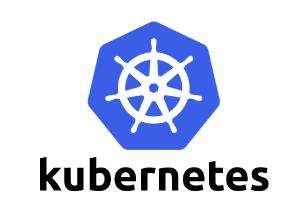


## 2、Kubernetes解决了什么问题

- 通过 Kubernetes，分布式系统工具将拥有网络效应。每当人们为 Kubernetes 制作出的新的工具，都会让所有其他工具更完善。因此，这进一步巩固了 Kubernetes 的标准地位。
- 云提供商并非可替换的商品。不同的云提供的服务会变得越来越独特和不同。如果可以访问不同的云提供商提供的不同服务，那么企业将因此受益。
- 当多节点应用与单节点应用一样可靠时，我们将看到定价模型的变化。
- 这就是为什么我会被 Kubernetes 洗脑的原因，它是跨越异构系统的一个标准层。
- 将来，我们会像讨论编译器和操作系统内核一样讨论 Kubernetes。 Kubernetes 将会是低层级的管路系统，而不在普通应用开发人员的视野之内。

Kubernetes 已成为部署分布式应用的标准方式。在不远的将来，任何新成立的互联网公司都将用到 Kubernetes，无论其是否意识到这点。许多旧应用也正在迁移到 Kubernetes。


#### 2.1 起因：Docker


#### 单一稳定的一体化模型

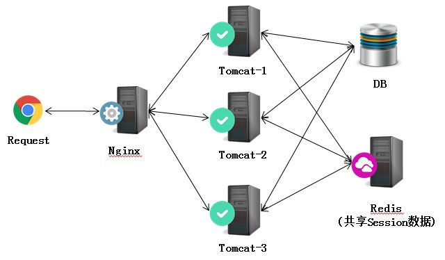

#### 微型化的应用部署模型

(微服务、分布式、集群、高可用、负载均衡...)

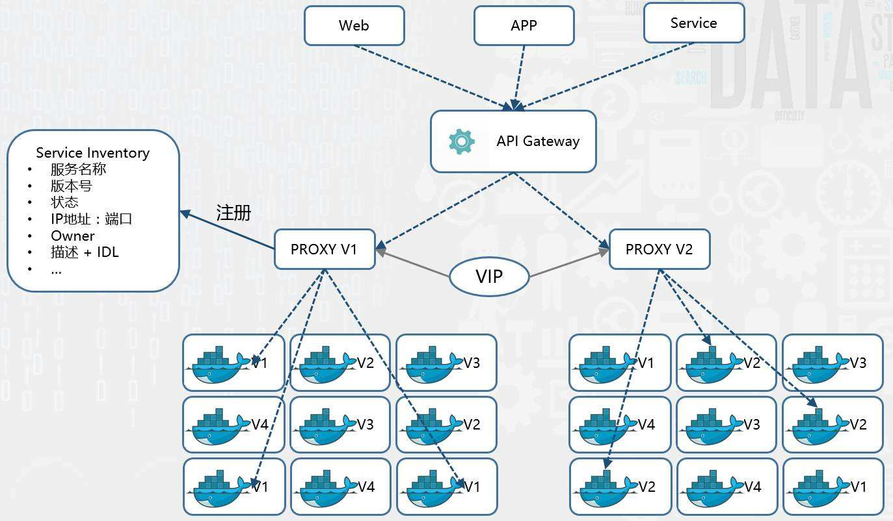


#### 2.2 容器编排？是需要标准的？

如此多的docker该如何管理(通信、负载均衡、资源共享管理、容灾、监控、健康检查….)？


* Mesos


* docker swarm

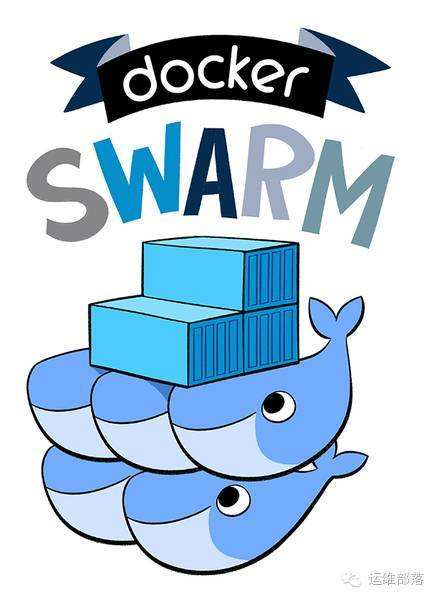

* kubernetes

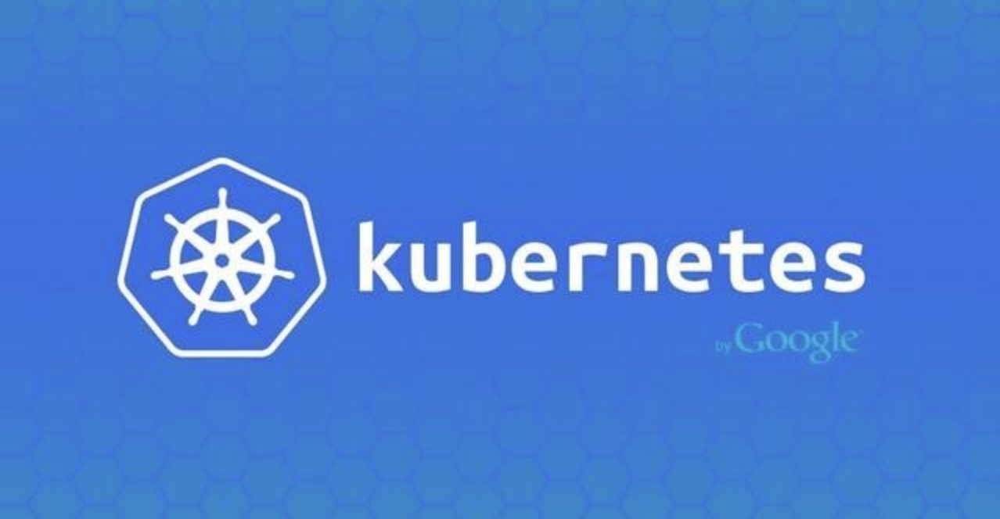


自2016年中，k8s表现出明显优势。

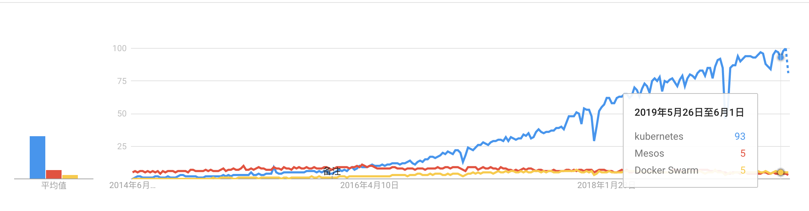


### 3. kubernetes工程师价值

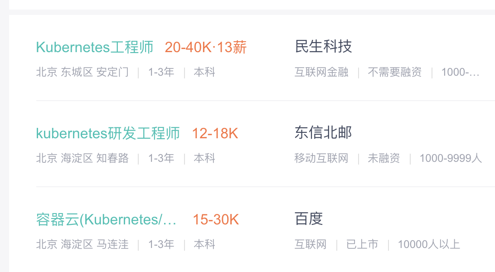


# 二、环境

## 2.1 部署软件环境版本

操作系统: `Ubuntu 18.10`(本教程采用server版本)

Docker： `docker-ce 18.06`

Kubernetes: `k8s 1.13.1`


## 2.2 Ubuntu搭建研发环境

我们直接下载Unbuntu18.10-server版本，server版本的好处是没有Desktop,可以节省资源。

```shell
wget http://mirrors.aliyun.com/ubuntu-releases/18.10/ubuntu-18.10-live-server-amd64.iso
```

> 注:也可以从配套资料中获取


## 2.3 Ubuntu安装过程

### 2.3.1 创建虚拟机

在VMWare 中启动安装虚拟过程

1. 创建新的虚拟机，选择推荐版本的iso文件 

   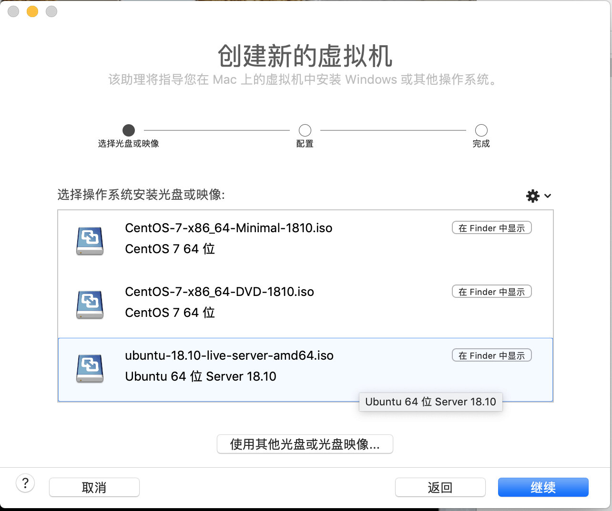

   

2. 选择自定义安装

   

3. 为此虚拟机选择操作系统 `Linux Ubuntu 64位`


1. 指定引导固件`UEFI` 不要选择`BIOS`

   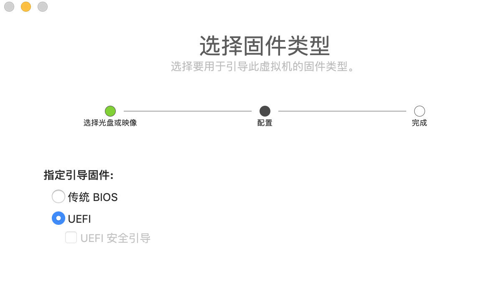

2. 命名为**Master**


1. 自定设置 存储为**UbuntuMaster**  **2CPU  2048MB 20GB硬盘**

   

   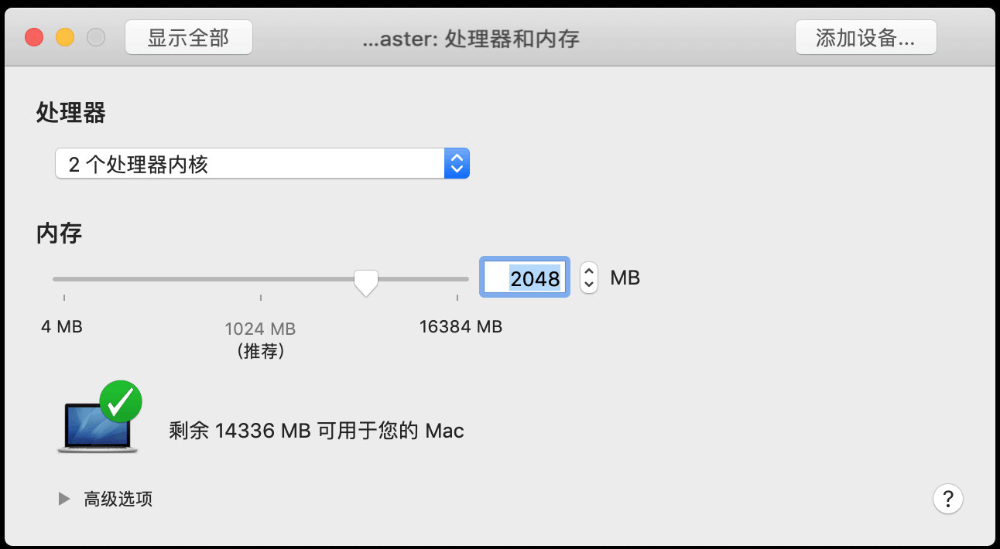

   

   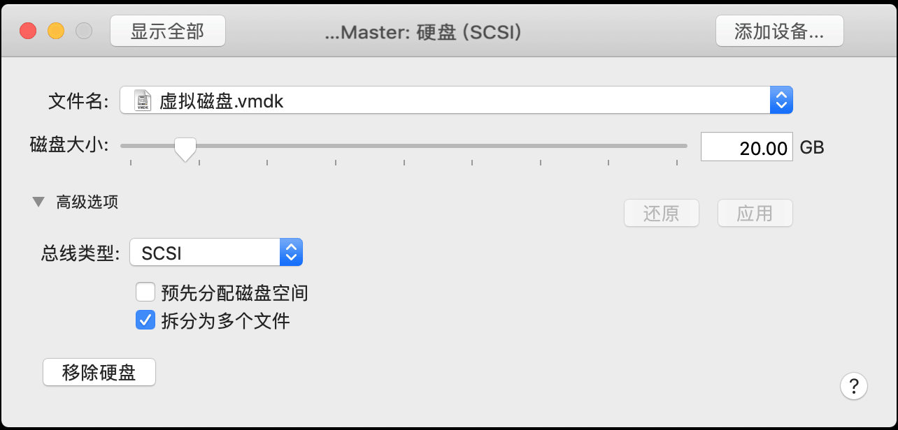

   

2. 建议移除声卡和摄像头


### 2.3.2 图形界面安装方式

1. 选择英文语言

2. 英文键盘

3. 设置国内镜像源头 `http://mirrors.aliyun.com/ubuntu/` 注意末尾的斜线

4. 设置您的用户名和密码，下文使用*YOUR_USERNAME* *YOUR_PASSWORD*

5. **切勿选择** `microk8s snap`  `stable: v1.14.2` 空格选中

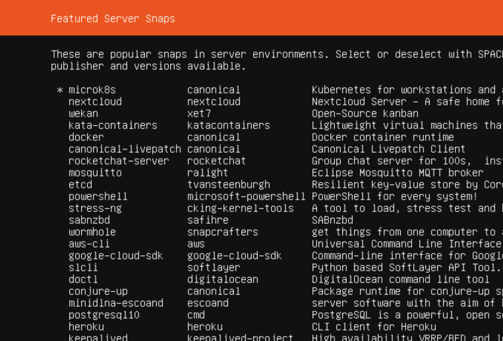


6. Tab键切换到*DONE*回车，开始安装过程


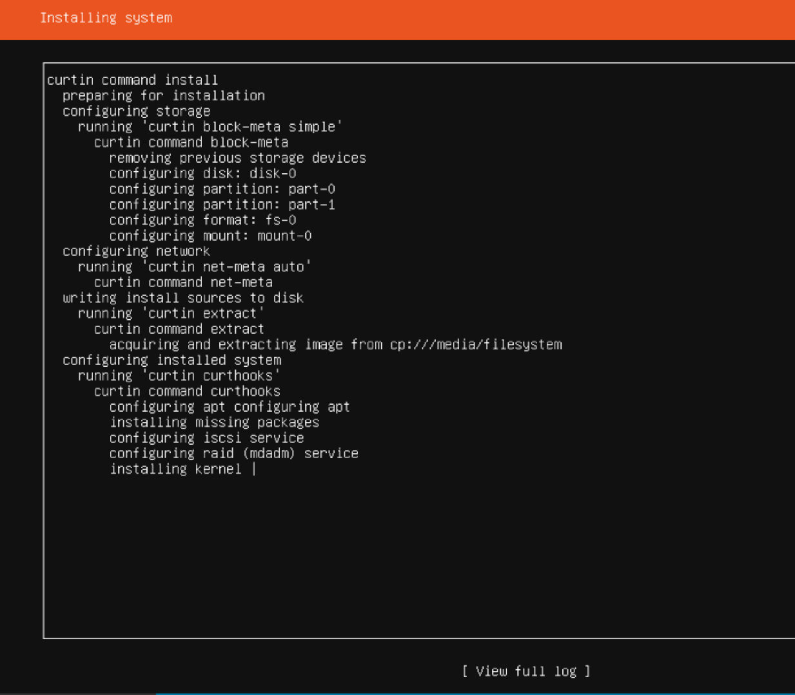

7. 安装结束后点击重启*Reboot Now*

   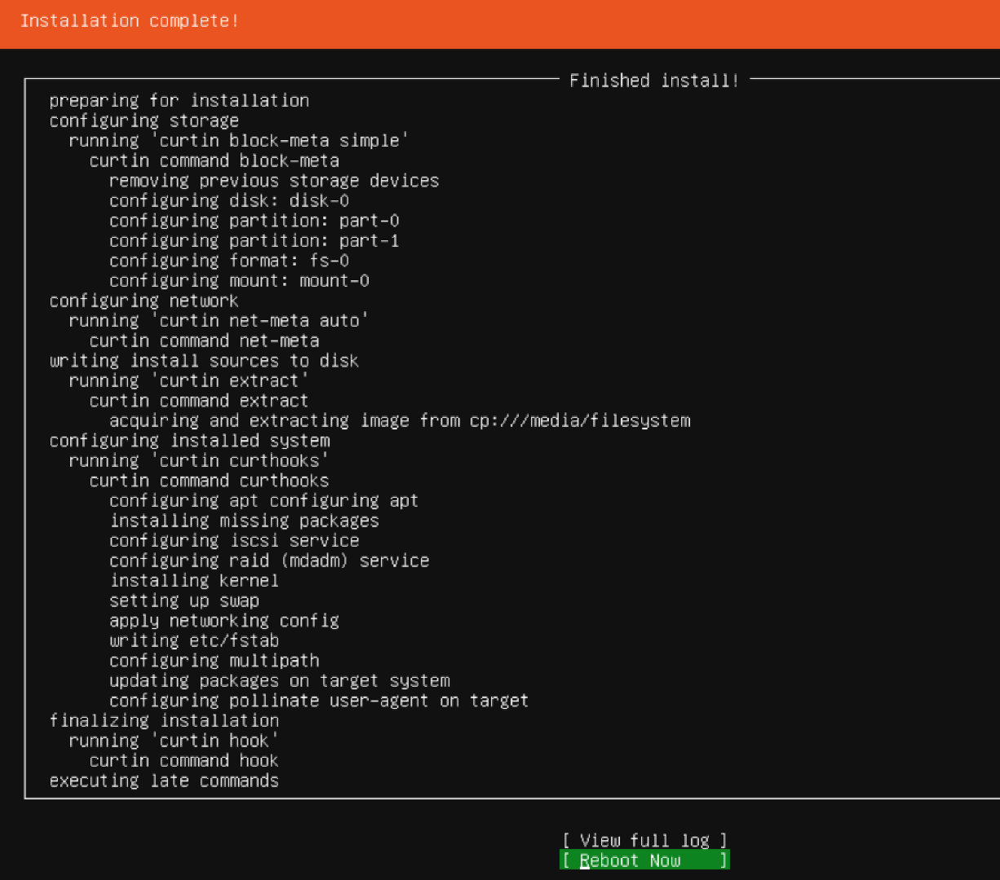
   
   


### 修改root密码

1. 安装过程中，输入用户名 `YOUR_USERNAME` 密码: `YOUR_PASSWORD`
2. 重新启动后登录 用户名 `YOUR_USERNAME` 密码: `YOUR_PASSWORD`
3. 确认登录成功后输入`sudo passwd` 输入上面的`YOUR_PASSWORD`,然后输入root用户的密码`root` 

```
设置root用户的密码root，是为了教学过程中简单。
但是在生产环境下禁止使用弱强度的密码。
```

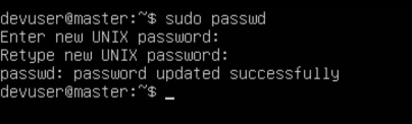

4. 执行`exit`退出当前登录用户，然后使用root用户重新登录
5. 输入`shutdown now`停机


## 2.4 修改主机名

修改主机名称

1. 使用root用户登录
2. 打开配置文件`vim /etc/cloud/cloud.cfg`
3. 修改配置`preserve_hostname: true`

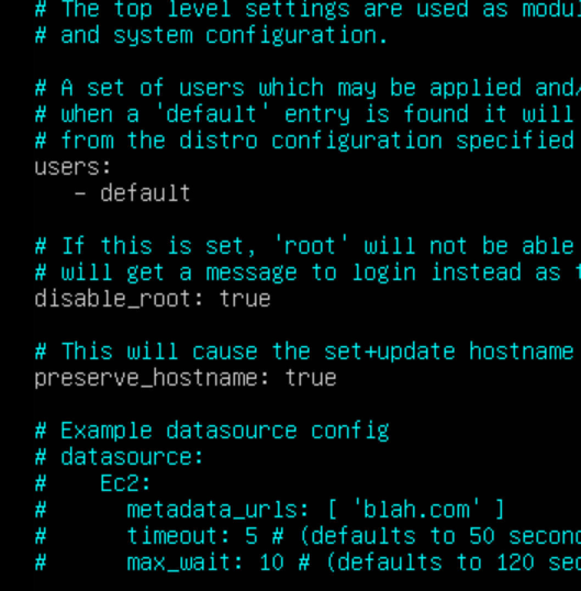

3. 重启

```shell
$ shutdown -r now
```

##  

## 2.5 配置静态IP(永久有效)(NAT模式)

1. 使用root用户登录Linux，如下以Node2为例
2. `vim /etc/netplan/50-cloud-init.yaml`
3.  参考如下截图修改配置文件

- UbuntuMaster `172.16.235.146`
- UbuntuNode1 `172.16.235.147`
- UbuntuNode2 `172.16.235.148`

```bash
network:
    ethernets:
        ens33:
            addresses: [192.168.236.177/24]
            dhcp4: false
            gateway4: 192.168.236.2
            nameservers:
                       addresses: [192.168.236.2]
            optional: true
    version: 2              
```


或者动态获取

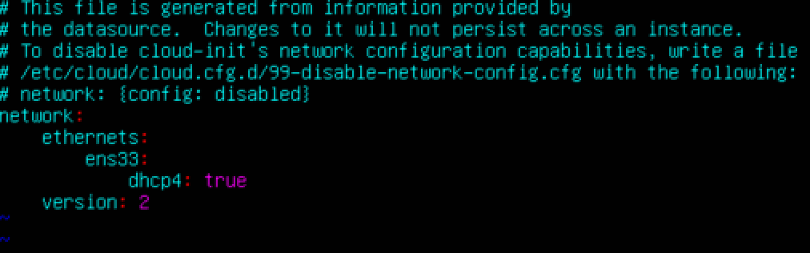


## 2.6 修改hosts

使用root用户登录

1. 打开hosts文件 `vim /etc/hosts`

2. 输入如下内容

   ```shell
   192.168.236.177 master
   ```
   
   这个ip是当前桥接或者NAT分配的IP地址

3. 重启机器`shutdown -r now`

## ip应用启动：

`$netplan apply`


# 三、Docker-CE安装及配置

## 3.1 Docker简介

### 3. 1.1 docker介绍

- docker是什么 ?

  > Docker 是一个开源的应用**容器引擎**，是直接运行在宿主操作系统之上的一个容器，使用沙箱机制完全虚拟出一个完整的操作，容器之间不会有任何接口，从而让容器与宿主机之间、容器与容器之间隔离的更加彻底。每个容器会有自己的权限管理，独立的网络与存储栈，及自己的资源管理能，使同一台宿主机上可以友好的共存多个容器。

- docker与虚拟机对比

  > <font color="red">**如果物理机是一幢住宅楼，虚拟机就是大楼中的一个个套间，而容器技术就是套间里的一个个隔断。**</font>

  - 虚拟化技术不同

    > - VMware Workstation、VirtualBoX
    >
    > 硬件辅助虚拟化：（Hardware-assisted Virtualization）是指通过硬件辅助支持模拟运行环境，使客户机操作系统可以独立运行，实现完全虚拟化的功能。
    >
    > - Docker
    >
    > 操作系统层虚拟化：（OS-level virtualization）这种技术将操作系统内核虚拟化，可以允许使用者空间软件实例被分割成几个独立的单元，在内核中运行，而不是只有一个单一实例运行。这个软件实例，也被称为是一个容器（containers）、虚拟引擎（Virtualization engine）、虚拟专用服务器（virtual private servers）。每个容器的进程是独立的，对于使用者来说，就像是在使用自己的专用服务器。
    >
    > <font color="red">以上两种虚拟化技术都属于软件虚拟化，在现有的物理平台上实现对物理平台访问的截获和模拟。在软件虚拟化技术中，有些技术不需要硬件支持；而有些软件虚拟化技术，则依赖硬件支持。</font>

  - 应用场景不同

    > - 虚拟机更擅长于彻底隔离整个运行环境。如: 云服务提供商通常采用虚拟机技术隔离不同的用户。
    > - Docker通常用于隔离不同的应用，例如前端，后端以及数据库。

  - 资源的使用率不同

    > 虚拟机启动需要数分钟，而Docker容器可以在数毫秒内启动。由于没有臃肿的从操作系统，Docker可以节省大量的磁盘空间以及其他系统资源。

- docker的版本

  - Docker-CE -> 社区版
    - Stable 版
      - 稳定版, 一个季度更新一次
    - Edge 版
      - 一个月更新一般
  - Docker-EE
    - 企业版
    - 收费的


## 3.2 配置国内源

### 3.2.1 基础准备


1. Docker 要求 Ubuntu 系统的内核版本高于 3.10 ，查看本页面的前提条件来验证你的 Ubuntu 版本是否支持 Docker。

  ```shell
  uname -r 
  4.18.0-21-generic(主版本必须保持一致)
  ```

  

2. 安装`curl `

  ```shell
  apt-get update && apt-get install -y curl telnet wget man \
  apt-transport-https \
  ca-certificates \
  software-properties-common vim 
  
  ```

  

3. 查看新版本号 

   - Ubuntu 18.10 

   ```shell
   $ lsb_release -c
   Codename:	cosmic
   ```

   

4. 查看确认国内源
   ```shell
   	$ cp /etc/apt/sources.list /etc/apt/sources.list.bak
   	$ cat /etc/apt/sources.list
   ```


### 3.2.2 在线安装Docker-ce(本教程不推荐)

>  (建议下面的手动安装方式，因为在线可能会出现版本不一致)

注意： **该国内源目前提供 `18.09`版本，与k8s不符。k8s推荐安装`Docker ce 18.06`**


1. 安装GPG秘钥和添加国内镜像

   ```shell
   $ curl -fsSL https://mirrors.ustc.edu.cn/docker-ce/linux/ubuntu/gpg | sudo apt-key add -
   ```

   添加国内源头

   ```shell
   $ add-apt-repository \
       "deb https://mirrors.ustc.edu.cn/docker-ce/linux/ubuntu \
       $(lsb_release -cs) \
       stable"
   ```

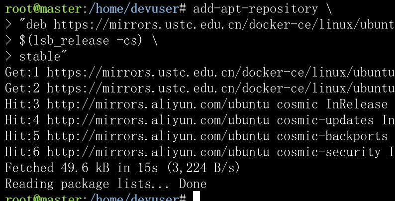


2. 更新国内源路径

```shell
apt update
```

3.安装查看版本指令

```
apt-get install -y apt-show-versions
```

4.查看docker-ce版本号

```
apt-show-versions -a docker-ce
```

5. 在线安装`Docker-ce`


 ```shell
	sudo apt-get update && apt-get install -y docker-ce
 ```

	注意到当前安装的版本是 `docker-ce_5%3a18.09.6~3-0~ubuntu-cosmic_amd64.deb`


### 3.2.3 手动安装Docker(离线安装)

1. 下载`docker-ce_18.06.1\~ce\~3-0\~ubuntu_amd64.deb`
2. 上传到上述文件到待安装服务器`master`
3. 登录待安装服务器，切换到root账户
4. `dpkg -i docker-ce_18.06.1\~ce\~3-0\~ubuntu_amd64.deb`

如果提示错误

```bash
itcast@master:~/package$ sudo dpkg -i docker-ce_18.06.1~ce~3-0~ubuntu_amd64.deb
 
[sudo] password for itcast: 
Selecting previously unselected package docker-ce.
(Reading database ... 100647 files and directories currently installed.)
Preparing to unpack docker-ce_18.06.1~ce~3-0~ubuntu_amd64.deb ...
Unpacking docker-ce (18.06.1~ce~3-0~ubuntu) ...
dpkg: dependency problems prevent configuration of docker-ce:
 docker-ce depends on libltdl7 (>= 2.4.6); however:
  Package libltdl7 is not installed.

dpkg: error processing package docker-ce (--install):
 dependency problems - leaving unconfigured
Processing triggers for man-db (2.8.4-2) ...
Processing triggers for systemd (239-7ubuntu10) ...
Errors were encountered while processing:
 docker-ce
```

表示当前docker-ce 依赖系统libltd17库，安装就可以了

```bash
$ apt-get install -y libltdl7
```


5. docker version 

```shell
Client:
 Version:           18.06.1-ce
 API version:       1.38
 Go version:        go1.10.3
 Git commit:        e68fc7a
 Built:             Tue Aug 21 17:24:56 2018
 OS/Arch:           linux/amd64
 Experimental:      false

Server:
 Engine:
  Version:          18.06.1-ce
  API version:      1.38 (minimum version 1.12)
  Go version:       go1.10.3
  Git commit:       e68fc7a
  Built:            Tue Aug 21 17:23:21 2018
  OS/Arch:          linux/amd64
  Experimental:     false
```

确保版本号是 `18.06`

## 3.3 启动Docker-ce

1. 开机并启动docker

```shell
sudo systemctl enable docker 
sudo systemctl start docker 
```

2. 重启，登录确认`docker`已经运行

```shell
itcast@ubuntu:~$ sudo docker ps 
CONTAINER ID        IMAGE               COMMAND             CREATED             STATUS              PORTS               NAMES
```

3. 下载`Alpine`镜像热身一下 `Docker`

```bash
~$ sudo docker run -it --rm alphine:latest sh 
```

输出内容如下，我们在`Docker`容器中测试三个命令，分别是

```bash
- `date`
- `time`
- `uname -r`
```

```bash
itcast@ubuntu:~$ sudo docker run -it --rm alpine:latest sh 
Unable to find image 'alpine:latest' locally
latest: Pulling from library/alpine
e7c96db7181b: Pull complete 
Digest: sha256:769fddc7cc2f0a1c35abb2f91432e8beecf83916c421420e6a6da9f8975464b6
Status: Downloaded newer image for alpine:latest
/ # date
Mon Jun 10 07:56:01 UTC 2019
/ # time
BusyBox v1.29.3 (2019-01-24 07:45:07 UTC) multi-call binary.

Usage: time [-vpa] [-o FILE] PROG ARGS

Run PROG, display resource usage when it exits

	-v	Verbose
	-p	POSIX output format
	-f FMT	Custom format
	-o FILE	Write result to FILE
	-a	Append (else overwrite)
/ # uname -r 
4.18.0-10-generic

```

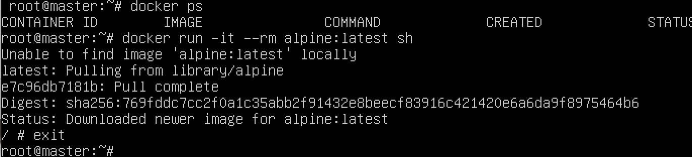


## 3.4 创建Docker用户组并添加当前用户

使用您的用户登录Linux然后执行如下操作，用户组docker可能已经存在。


如果使用普通用户目前是无法使用docker指令的

```bash
itcast@master:~$ docker ps
Got permission denied while trying to connect to the Docker daemon socket at unix:///var/run/docker.sock: Get http://%2Fvar%2Frun%2Fdocker.sock/v1.38/containers/json: dial unix /var/run/docker.sock: connect: permission denied
```

我们需要将当前的普通用户添加到当前的docker用户组中

```shell
sudo groupadd docker
sudo usermod -aG docker $USER
exit
```

重新登录使用普通用户登录:

```bash
itcast@master:~$ docker ps
CONTAINER ID        IMAGE               COMMAND             CREATED             STATUS              PORTS               NAMES
```

就可以使用了。


## 3.5 申请阿里云镜像加速器


如果不申请阿里云私人专属镜像加速器，鼓励复制如下本人申请的私人专属镜像加速器，直接使用即可。

```shell
https://ozcouv1b.mirror.aliyuncs.com
```

**申请步骤如下**

在阿里云注册自己账户

找到**容器镜像服务**，参考网址如下 

```shell
https://cr.console.aliyun.com/cn-hangzhou/instances/mirrors
```

点开左侧菜单**镜像中心**—>**镜像加速器**

右侧加速器地址，即使私人专属的镜像加速器地址，点击**复制**

粘贴到一个文本文件留存


------

# 3.6 docker配置国内镜像加速器

> 目的 : 为了下载docker镜像更快

您可以通过修改`daemon`配置文件`/etc/docker/daemon.json`来使用加速器。

创建`/etc/docker/daemon.json`文件，内容如下：

```json
{
  "registry-mirrors": ["https://ozcouv1b.mirror.aliyuncs.com"]
}
```

重启docker服务

```shell
# 重载所有修改过的配置文件
sudo systemctl daemon-reload
# 重启Docker服务
sudo systemctl restart docker
```

# 四、Kubernetes 安装及部署

## 4.1 k8s安装环境准备

### 4.1.1 配置并安装k8s国内源

1. 创建配置文件`sudo touch /etc/apt/sources.list.d/kubernetes.list` 

   内容如下:
   
   ```
   deb http://mirrors.ustc.edu.cn/kubernetes/apt kubernetes-xenial main
   ```

   

2. 执行`sudo apt update` 更新操作系统源，开始会遇见如下错误

   

   ```bash
   tcast@master:~$ sudo apt update
   Get:1 http://mirrors.ustc.edu.cn/kubernetes/apt kubernetes-xenial InRelease [8,993 B]
   Err:1 http://mirrors.ustc.edu.cn/kubernetes/apt kubernetes-xenial InRelease    
     The following signatures couldn't be verified because the public key is not available: NO_PUBKEY 6A030B21BA07F4FB
   Hit:2 http://mirrors.aliyun.com/ubuntu cosmic InRelease                        
   Hit:3 http://mirrors.aliyun.com/ubuntu cosmic-updates InRelease                
   Hit:4 http://mirrors.aliyun.com/ubuntu cosmic-backports InRelease              
   Hit:5 http://mirrors.aliyun.com/ubuntu cosmic-security InRelease               
   Err:6 https://mirrors.ustc.edu.cn/docker-ce/linux/ubuntu cosmic InRelease      
     Could not wait for server fd - select (11: Resource temporarily unavailable) [IP: 202.141.176.110 443]
   Reading package lists... Done                          
   W: GPG error: http://mirrors.ustc.edu.cn/kubernetes/apt kubernetes-xenial InRelease: The following signatures couldn't be verified because the public key is not available: NO_PUBKEY 6A030B21BA07F4FB
   E: The repository 'http://mirrors.ustc.edu.cn/kubernetes/apt kubernetes-xenial InRelease' is not signed.
   N: Updating from such a repository can't be done securely, and is therefore disabled by default.
   N: See apt-secure(8) manpage for repository creation and user configuration details.
   ```

   

   其中：

   ```bash
   The following signatures couldn't be verified because the public key is not available: NO_PUBKEY 6A030B21BA07F4FB
   ```

   签名认证失败，需要重新生成。记住上面的*NO_PUBKEY* `6A030B21BA07F4FB`

   

3. 添加认证key

   运行如下命令，添加错误中对应的key(错误中NO_PUBKEY后面的key的后8位)

   ```shell
   gpg --keyserver keyserver.ubuntu.com --recv-keys BA07F4FB
   ```

   接着运行如下命令，确认看到**OK**，说明成功，之后进行安装:

   ```shell
   gpg --export --armor BA07F4FB | sudo apt-key add -
   ```

4. 再次重新`sudo apt update`更新系统下载源数据列表

```bash
itcast@master:~$ sudo apt update
Hit:1 https://mirrors.ustc.edu.cn/docker-ce/linux/ubuntu cosmic InRelease                  
Hit:2 http://mirrors.aliyun.com/ubuntu cosmic InRelease                                    
Hit:3 http://mirrors.aliyun.com/ubuntu cosmic-updates InRelease                            
Hit:4 http://mirrors.aliyun.com/ubuntu cosmic-backports InRelease                          
Hit:5 http://mirrors.aliyun.com/ubuntu cosmic-security InRelease                           
Get:6 http://mirrors.ustc.edu.cn/kubernetes/apt kubernetes-xenial InRelease [8,993 B]      
Ign:7 http://mirrors.ustc.edu.cn/kubernetes/apt kubernetes-xenial/main amd64 Packages
Get:7 http://mirrors.ustc.edu.cn/kubernetes/apt kubernetes-xenial/main amd64 Packages [26.6 kB]
Fetched 26.6 kB in 42s (635 B/s)    
Reading package lists... Done
Building dependency tree       
Reading state information... Done
165 packages can be upgraded. Run 'apt list --upgradable' to see them.
```

以上没有报和错误异常，表示成功。

### 4.1.2 禁止基础设施

1. 禁止防火墙

   ```shell
   $ sudo ufw disable
   Firewall stopped and disabled on system startup
   ```

2. 关闭swap

   ```shell
   # 成功
   $ sudo swapoff -a 
   # 永久关闭swap分区
   $ sudo sed -i 's/.*swap.*/#&/' /etc/fstab
   ```

3. 禁止selinux

```shell
# 安装操控selinux的命令
$ sudo apt install -y selinux-utils
# 禁止selinux
$ setenforce 0
# 重启操作系统
$ shutdown -r now
# 查看selinux是否已经关闭
$ sudo getenforce
Disabled(表示已经关闭)
```


## 4.2 k8s系统网络配置

(1) 配置内核参数，将桥接的IPv4流量传递到iptables的链

创建`/etc/sysctl.d/k8s.conf`文件

添加内容如下:

```ini
net.bridge.bridge-nf-call-ip6tables = 1
net.bridge.bridge-nf-call-iptables = 1
vm.swappiness = 0
```

(2) 执行命令使修改生效

```bash
# 【候选】建议执行下面的命令
$ sudo modprobe br_netfilter
$ sudo sysctl -p /etc/sysctl.d/k8s.conf
```


## 4.3 安装k8s

>  **注意: 切换到root用户 `$ su`**

1. 安装Kubernetes 目前安装版本  `v1.13.1`

   ```shell
   $ apt update && apt-get install -y kubelet=1.13.1-00 kubernetes-cni=0.6.0-00 kubeadm=1.13.1-00 kubectl=1.13.1-00
   ```

   

2. 设置为开机重启

   ```shell
   $ sudo systemctl enable kubelet && systemctl start kubelet
   $ sudo shutdown -r now
   ```


## 4.4 验证k8s

1. 使用root用户登录`Master`主机

2. 执行如下个命令

   ```shell
   kubectl get nodes 
   ```
   

输出如下

   ```shell
   $ kubectl get nodes
   The connection to the server localhost:8080 was refused - did you specify the right host or port?
   ```

3. 查看当前k8s版本 

   ```bash
   $ kubectl version
   ```

   

```bash
Client Version: version.Info{Major:"1", Minor:"13", GitVersion:"v1.13.1", GitCommit:"eec55b9ba98609a46fee712359c7b5b365bdd920", GitTreeState:"clean", BuildDate:"2018-12-13T10:39:04Z", GoVersion:"go1.11.2", Compiler:"gc", Platform:"linux/amd64"}
The connection to the server localhost:8080 was refused - did you specify the right host or port?
```


# 五、创建企业Kubernetes多主机集群环境

## 5.1 创建两个节点(两个虚拟机)

1. 在VMWare中创建完整克隆，分别命名为`UbuntuNode1`和`UbuntuNode2`


分别对两个完整克隆的虚拟机进行如下操作，修改主机名称和静态IP

1. 使用root用户登录
2. 打开配置文件`vim /etc/cloud/cloud.cfg`
3. 修改配置`preserve_hostname: true`


3. 修改`/etc/hostname`，只有一行 `node1`或`node2`

   

## 5.2 master和node基础配置

### 5.2.1 给node配置hostname

`node1`主机

/etc/hostname

```bash
node1
```

`node2`主机

/et/hostname

```bash
node2
```

2.确认配置的三台机器的主机名称

```shell
$ cat /etc/hosts
$ shutdown -r now
```


### 5.2.2 配置IP地址

* master

`/etc/netplan/50-cloud-init.yaml `

```bash
network:
    ethernets:
        ens33:
            addresses: [192.168.236.177/24]
            dhcp4: false
            gateway4: 192.168.236.2
            nameservers:
                       addresses: [192.168.236.2]
            optional: true
    version: 2
```

重启ip配置

```bash
netplan apply
```


* node1

`/etc/netplan/50-cloud-init.yaml `

```bash
network:
    ethernets:
        ens33:
            addresses: [192.168.236.178/24]
            dhcp4: false
            gateway4: 192.168.236.2
            nameservers:
                       addresses: [192.168.236.2]
            optional: true
    version: 2
```

重启ip配置

```bash
netplan apply
```


* node2

`/etc/netplan/50-cloud-init.yaml `

```bash
network:
    ethernets:
        ens33:
            addresses: [192.168.236.179/24]
            dhcp4: false
            gateway4: 192.168.236.2
            nameservers:
                       addresses: [192.168.236.2]
            optional: true
    version: 2
```

重启ip配置

```bash
netplan apply
```


### 5.2.3 修改hosts文件

注意： (Master、Node1、Node2都需要配置)

使用root用户登录

1. 打开hosts文件 `vim /etc/hosts`

2. 输入如下内容

   ```shell
   172.16.235.146 master
   172.16.235.147 node1
   172.16.235.148 node2
   ```

3. 重启机器`shutdown -r now`


## 5.3 配置Master节点

### 5.3.1 创建工作目录

```shell
$ mkdir /home/itcast/working
$ cd /home/itcast/working/
```

### 5.3.2 创建kubeadm.conf配置文件

1. 创建k8s的管理工具`kubeadm`对应的配置文件，候选操作在`home/itcast/working/`目录下

使用kubeadm配置文件，通过在配置文件中指定docker仓库地址，便于内网快速部署。

生成配置文件

```
kubeadm config print init-defaults ClusterConfiguration > kubeadm.conf
```

2. 修改`kubeadm.conf `中的如下两项:

- imageRepository  
- kubernetesVersion

```bash
vi kubeadm.conf
# 修改 imageRepository: k8s.gcr.io
# 改为 registry.cn-beijing.aliyuncs.com/imcto
imageRepository: registry.cn-beijing.aliyuncs.com/imcto
# 修改kubernetes版本kubernetesVersion: v1.13.0
# 改为kubernetesVersion: v1.13.1
kubernetesVersion: v1.13.1
```

3. 修改`kubeadm.conf`中的API服务器地址，后面会频繁使用这个地址。

* localAPIEndpoint:

```shell
localAPIEndpoint:
  advertiseAddress: 192.168.236.177
  bindPort: 6443
```

> 注意: `192.168.236.177`是master主机的ip地址

4. 配置子网网络

```ini
networking:
  dnsDomain: cluster.local
  podSubnet: 10.244.0.0/16
  serviceSubnet: 10.96.0.0/12
scheduler: {}
```

这里的`10.244.0.0/16` 和 `10.96.0.0/12`分别是k8s内部pods和services的子网网络，最好使用这个地址，后续flannel网络需要用到。


### 5.3.3 拉取K8s必备的模块镜像

1. 查看一下都需要哪些镜像文件需要拉取

```
$ kubeadm config images list --config kubeadm.conf
registry.cn-beijing.aliyuncs.com/imcto/kube-apiserver:v1.13.1
registry.cn-beijing.aliyuncs.com/imcto/kube-controller-manager:v1.13.1
registry.cn-beijing.aliyuncs.com/imcto/kube-scheduler:v1.13.1
registry.cn-beijing.aliyuncs.com/imcto/kube-proxy:v1.13.1
registry.cn-beijing.aliyuncs.com/imcto/pause:3.1
registry.cn-beijing.aliyuncs.com/imcto/etcd:3.2.24
registry.cn-beijing.aliyuncs.com/imcto/coredns:1.2.6
```

2. 拉取镜像

```bash
#下载全部当前版本的k8s所关联的镜像
kubeadm config images pull --config ./kubeadm.conf
```

### 5.3.4 初始化kubernetes环境

```bash
#初始化并且启动
$ sudo kubeadm init --config ./kubeadm.conf
```

更多kubeadm配置文件参数详见

```
kubeadm config print-defaults
```


**k8s启动成功输出内容较多，但是记住末尾的内容**

```shell
Your Kubernetes master has initialized successfully!

To start using your cluster, you need to run the following as a regular user:

  mkdir -p $HOME/.kube
  sudo cp -i /etc/kubernetes/admin.conf $HOME/.kube/config
  sudo chown $(id -u):$(id -g) $HOME/.kube/config

You should now deploy a pod network to the cluster.
Run "kubectl apply -f [podnetwork].yaml" with one of the options listed at:
  https://kubernetes.io/docs/concepts/cluster-administration/addons/

You can now join any number of machines by running the following on each node
as root:

  kubeadm join 192.168.236.177:6443 --token abcdef.0123456789abcdef --discovery-token-ca-cert-hash sha256:e778d3665e52f5a680a87b00c6d54df726c2eda601c0db3bfa4bb198af2262a8
```

按照官方提示，执行以下操作。


1. 执行如下命令

   ```shell
   $ mkdir -p $HOME/.kube
   $ sudo cp -i /etc/kubernetes/admin.conf $HOME/.kube/config
   $ sudo chown $(id -u):$(id -g) $HOME/.kube/config
   ```

2. 创建系统服务并启动

   ```shell
   # 启动kubelet 设置为开机自启动
   $ sudo systemctl enable kubelet
   # 启动k8s服务程序
   $ sudo systemctl start kubelet
   ```
### 5.3.5 验证kubernetes启动结果

1. 验证输入，注意显示master状态是`NotReady`，证明初始化服务器成功
```shell
$ kubectl get nodes
NAME     STATUS     ROLES    AGE   VERSION
master   NotReady   master   12m   v1.13.1
```

2. 查看当前k8s集群状态

```shell
$ kubectl get cs
NAME                 STATUS    MESSAGE              ERROR
scheduler            Healthy   ok
controller-manager   Healthy   ok
etcd-0               Healthy   {"health": "true"}
```

目前只有一个master，还没有node，而且是NotReady状态，那么我们需要将node加入到master管理的集群中来。在加入之前，我们需要先配置k8s集群的内部通信网络，这里采用的是flannel网络。


### 5.3.6 部署集群内部通信flannel网络

```bash
$cd $HOME/working
$wget https://raw.githubusercontent.com/coreos/flannel/a70459be0084506e4ec919aa1c114638878db11b/Documentation/kube-flannel.yml
```

编辑这个文件，确保flannel网络是对的,找到` net-conf.json`标记的内容是否正确。

```ini
 net-conf.json: |
    {
      "Network": "10.244.0.0/16",
      "Backend": {
        "Type": "vxlan"
      }
```

**这个"10.244.0.0/16"和 ./kubeadm.conf中的podsubnet的地址要一致。**

应用当前flannel配置文件

```shell
itcast@master:~/working$ kubectl apply -f kube-flannel.yml 
```

输出结果如下 

```shell
root@master:~/working# kubectl apply -f https://raw.githubusercontent.com/coreos/flannel/a70459be0084506e4ec919aa1c114638878db11b/Documentation/kube-flannel.yml
clusterrole.rbac.authorization.k8s.io/flannel created
clusterrolebinding.rbac.authorization.k8s.io/flannel created
serviceaccount/flannel created
configmap/kube-flannel-cfg created
daemonset.extensions/kube-flannel-ds-amd64 created
daemonset.extensions/kube-flannel-ds-arm64 created
daemonset.extensions/kube-flannel-ds-arm created
daemonset.extensions/kube-flannel-ds-ppc64le created
daemonset.extensions/kube-flannel-ds-s390x created
```


安装flannel网络前 执行`kubectl get nodes`输出结果如下

```bash
itcast@master:~/working$ kubectl get node
NAME     STATUS     ROLES    AGE   VERSION
master   NotReady   master   10m   v1.13.1
```


安装flannel网络后 执行`kubectl get nodes`输出结果如下

```bash
itcast@master:~/working$ kubectl get node
NAME     STATUS   ROLES    AGE   VERSION
master   Ready    master   10m   v1.13.1
```


此时master已经是`Ready`状态了，表示已经配置成功了，那么我们就需要配置node来加入这个集群。


## 5.4 配置Node

### 5.4.1 确认外部环境

1. 确认关闭swap 

   ```shell
   apt install -y selinux-utils
   swapoff -a
   ```
   
2. 禁止selinux

   ```shell
   setenforce 0
   ```

3. 确认关闭防火墙

   ```shell
   ufw disable
   ```

### 5.4.2 配置k8s集群的Node主机环境

1. 启动k8s后台服务

   ```shell
   # 启动kubelet 设置为开机自启动
   $ sudo systemctl enable kubelet
   # 启动k8s服务程序
   $ sudo systemctl start kubelet
   ```

2. 将master机器的`/etc/kubernetes/admin.conf`传到到node1和node2

   登录`master`终端

   ```shell
   #将admin.conf传递给node1
   sudo scp /etc/kubernetes/admin.conf itcast@192.168.236.178:/home/itcast/
   #将admin.conf传递给node2
   sudo scp /etc/kubernetes/admin.conf itcast@192.168.236.179:/home/itcast/
   ```

3. 登录`node1`终端，创建基础kube配置文件环境

```bash
$ mkdir -p $HOME/.kube
$ sudo cp -i $HOME/admin.conf $HOME/.kube/config
$ sudo chown $(id -u):$(id -g) $HOME/.kube/config
```

4. 登录`node2`终端，创建基础kube配置文件环境

```bash
$ mkdir -p $HOME/.kube
$ sudo cp -i $HOME/admin.conf $HOME/.kube/config
$ sudo chown $(id -u):$(id -g) $HOME/.kube/config
```

5. `node1`和`node2`分别连接`master`加入master集群。这里用的是`kubeadm join`指令

```shell
$ sudo kubeadm join 192.168.236.177:6443 --token abcdef.0123456789abcdef --discovery-token-ca-cert-hash sha256:e778d3665e52f5a680a87b00c6d54df726c2eda601c0db3bfa4bb198af2262a8
```

这里要注意，使用的hash应该是`master`主机 `kubeadm init`成功之后生成的hash码。


6. 应用两个node主机分别应用flannel网络

将`master`中的`kube-flannel.yml`分别传递给两个`node`节点.

```bash
#将kube-flannel.yml传递给node1
sudo scp $HOME/working/kube-flannel.yml itcast@192.168.236.178:/home/itcast/
#将kube-flannel.yml传递给node2
sudo scp $HOME/working/kube-flannel.yml itcast@192.168.236.179:/home/itcast/
```

分别启动`flannel`网络

```bash
itcast@node1:~$ kubectl apply -f kube-flannel.yml 
```

```bash
itcast@node2:~$ kubectl apply -f kube-flannel.yml
```


7. 查看node是否已经加入到k8s集群中(需要等一段时间才能ready)

```bash
itcast@node2:~$ kubectl get nodes
NAME     STATUS   ROLES    AGE     VERSION
master   Ready    master   35m     v1.13.1
node1    Ready    <none>   2m23s   v1.13.1
node2    Ready    <none>   40s     v1.13.1
```


# 六、应用实例

## 6.1 创建MySQL实例

### 6.1.1 定义描述文件

```yaml
apiVersion: v1
kind: ReplicationController                            #副本控制器RC
metadata:
  name: mysql                                          #RC的名称，全局唯一
spec:
  replicas: 1                                          #Pod副本的期待数量
  selector:
    app: mysql                                         #符合目标的Pod拥有此标签
  template:                                            #根据此模板创建Pod的副本（实例）
    metadata:
      labels:
        app: mysql                                     #Pod副本拥有的标签，对应RC的Selector
    spec:
      containers:                                      #Pod内容器的定义部分
      - name: mysql                                    #容器的名称
        image: hub.c.163.com/library/mysql              #容器对应的Docker image
        ports: 
        - containerPort: 3306                          #容器应用监听的端口号
        env:                                           #注入容器内的环境变量
        - name: MYSQL_ROOT_PASSWORD 
          value: "123456"
```

### 6.1.2 加载ReplicationController副本控制器描述文件

创建好mysql-rc.yaml后，在master节点使用kubectl命令将它发布到k8s集群中。

```shell
kubectl create -f mysql-rc.yaml
```

### 6.1.3 查看启动状态

通过查看当前的`pods`列表，是否已经启动成功:


### 6.1.4 网络异常解决方案(未出现问题可直接跳过)

注意：如果这里出现了`ContainerCreating`状态，那么可以尝试如下解决办法:


```bash
itcast@master:~/working$ kubectl get pods
NAME          READY   STATUS              RESTARTS   AGE
mysql-tscrh   0/1     ContainerCreating   0          17m
```

目前mysql-tscrh 描述文件 已经创建，但是没有启动成功. 状态是`ContainerCreating` 没有启动起来.


通过`kubectl describe pods `来查看`pods`的详细状态

```bash
itcast@master:~/working$ kubectl describe pods mysql
Name:               mysql-tscrh
Namespace:          default
Priority:           0
PriorityClassName:  <none>
Node:               node1/192.168.236.178
Start Time:         Mon, 17 Jun 2019 09:10:35 +0000
Labels:             app=mysql
Annotations:        <none>
Status:             Pending
IP:                 
Controlled By:      ReplicationController/mysql
Containers:
  mysql:
    Container ID:   
    Image:          hub.c.163.com/library/mysql
    Image ID:       
    Port:           3306/TCP
    Host Port:      0/TCP
    State:          Waiting
      Reason:       ContainerCreating
    Ready:          False
    Restart Count:  0
    Environment:
      MYSQL_ROOT_PASSWORD:  123456
    Mounts:
      /var/run/secrets/kubernetes.io/serviceaccount from default-token-q6ggq (ro)
Conditions:
  Type              Status
  Initialized       True 
  Ready             False 
  ContainersReady   False 
  PodScheduled      True 
Volumes:
  default-token-q6ggq:
    Type:        Secret (a volume populated by a Secret)
    SecretName:  default-token-q6ggq
    Optional:    false
QoS Class:       BestEffort
Node-Selectors:  <none>
Tolerations:     node.kubernetes.io/not-ready:NoExecute for 300s
                 node.kubernetes.io/unreachable:NoExecute for 300s
Events:
  Type     Reason                  Age                     From               Message
  ----     ------                  ----                    ----               -------
  Normal   Scheduled               22m                     default-scheduler  Successfully assigned default/mysql-tscrh to node1
  Warning  FailedCreatePodSandBox  22m                     kubelet, node1     Failed create pod sandbox: rpc error: code = Unknown desc = failed to set up sandbox container "58d143373e767c40610587624c667d8e20dd77fa397952406a085f2ae1dc38e6" network for pod "mysql-tscrh": NetworkPlugin cni failed to set up pod "mysql-tscrh_default" network: open /run/flannel/subnet.env: no such file or directory
  Warning  FailedCreatePodSandBox  22m                     kubelet, node1     Failed create pod sandbox: rpc error: code = Unknown desc = failed to set up sandbox container "81d12726dbe075c64af48142638e98863231e8201ccc292f0dda1fccfa7fdaec" network for pod "mysql-tscrh": NetworkPlugin cni failed to set up pod "mysql-tscrh_default" network: open /run/flannel/subnet.env: no such file or directory
  Warning  FailedCreatePodSandBox  22m                     kubelet, node1     Failed create pod sandbox: rpc error: code = Unknown desc = failed to set up sandbox container "8bd77ee0176d369435ead7bd3c2675b7bbcbdc2b052cf34c784f04053a7d5288" network for pod "mysql-tscrh": NetworkPlugin cni failed to set up pod "mysql-tscrh_default" network: open /run/flannel/subnet.env: no such file or directory
  Warning  FailedCreatePodSandBox  22m                     kubelet, node1     Failed create pod sandbox: rpc error: code = Unknown desc = failed to set up sandbox container "0733fc209e085e96f5823a2280b012a609dace41fda967c5ae951005a8699ce6" network for pod "mysql-tscrh": NetworkPlugin cni failed to set up pod "mysql-tscrh_default" network: open /run/flannel/subnet.env: no such file or directory
  Warning  FailedCreatePodSandBox  22m                     kubelet, node1     Failed create pod sandbox: rpc error: code = Unknown desc = failed to set up sandbox container "91f337eb334612b2e7426d820ba4b15a9c9c549050517d459508832b69780b5f" network for pod "mysql-tscrh": NetworkPlugin cni failed to set up pod "mysql-tscrh_default" network: open /run/flannel/subnet.env: no such file or directory
  Warning  FailedCreatePodSandBox  22m                     kubelet, node1     Failed create pod sandbox: rpc error: code = Unknown desc = failed to set up sandbox container "48cbba9896068a774d9128a6864394e8726a0d857bae61036421ad73f5d6e3dd" network for pod "mysql-tscrh": NetworkPlugin cni failed to set up pod "mysql-tscrh_default" network: open /run/flannel/subnet.env: no such file or directory
  Warning  FailedCreatePodSandBox  22m                     kubelet, node1     Failed create pod sandbox: rpc error: code = Unknown desc = failed to set up sandbox container "d259778aa19418a9a429b3175b66afae3d8ffb7324ec9df492b2947dbc153460" network for pod "mysql-tscrh": NetworkPlugin cni failed to set up pod "mysql-tscrh_default" network: open /run/flannel/subnet.env: no such file or directory
  Warning  FailedCreatePodSandBox  22m                     kubelet, node1     Failed create pod sandbox: rpc error: code = Unknown desc = failed to set up sandbox container "3d01c00ac9eaac7b2e983402be38c1cf60c4bbd1d454aa45329ce0ca0c2bf792" network for pod "mysql-tscrh": NetworkPlugin cni failed to set up pod "mysql-tscrh_default" network: open /run/flannel/subnet.env: no such file or directory
  Warning  FailedCreatePodSandBox  22m                     kubelet, node1     Failed create pod sandbox: rpc error: code = Unknown desc = failed to set up sandbox container "98879cbb0405dac3a24753dd1986070a53fe9ee9f1b819996a903c19286a2bb7" network for pod "mysql-tscrh": NetworkPlugin cni failed to set up pod "mysql-tscrh_default" network: open /run/flannel/subnet.env: no such file or directory
  Warning  FailedCreatePodSandBox  7m49s (x838 over 22m)   kubelet, node1     (combined from similar events): Failed create pod sandbox: rpc error: code = Unknown desc = failed to set up sandbox container "60923335b41c2d0412b279bdb6150f9b9b7eae20c4a02549e35509083c01384b" network for pod "mysql-tscrh": NetworkPlugin cni failed to set up pod "mysql-tscrh_default" network: open /run/flannel/subnet.env: no such file or directory
  Normal   SandboxChanged          2m49s (x1127 over 22m)  kubelet, node1     Pod sandbox changed, it will be killed and re-created.
```

会看到一个错误:

```
"mysql-tscrh": NetworkPlugin cni failed to set up pod "mysql-tscrh_default" network: open /run/flannel/subnet.env: no such file or directory
```

这是缺少/run/flannel/subnet.env文件

##### 解决办法：配置flannel网络

分别在三台服务器上执行如下步骤

1. 创建目录 

   ```bash
   sudo mkdir -p /run/flannel
   ```

2. 创建环境描述文件

   ```shell
   $ sudo tee /run/flannel/subnet.env <<-'EOF'
   FLANNEL_NETWORK=10.244.0.0/16
   FLANNEL_SUBNET=10.244.0.1/24
   FLANNEL_MTU=1450
   FLANNEL_IPMASQ=true
   EOF
   ```


### 6.1.5 查看mysql实例集群状态

```bash
itcast@master:~/working$ kubectl get pods
NAME          READY   STATUS              RESTARTS   AGE
mysql-tscrh   0/1     Running   0          17m
```

如果为`Running`状态，则为mysql集群启动成功。


## 6.2 创建Tomcat实例

### 6.2.1 定义描述文件

```yaml
apiVersion: v1
kind: ReplicationController
metadata:
  name: myweb
spec:
  replicas: 5                                       #Pod副本期待数量为5
  selector:
    app: myweb
  template:
    metadata:
      labels:
        app: myweb
    spec:
      containers:
      - name: myweb
        image: docker.io/kubeguide/tomcat-app:v1
        ports: 
        - containerPort: 8080
        env:
        - name: MYSQL_SERVICE_HOST
          value: "mysql"
        - name: MYSQL_SERVICE_PORT
          value: "3306"
```


### 6.2.2 加载RC副本描述文件

```shell
$ kubectl create -f myweb-rc.yaml
replicationcontroller/myweb created
$ kubectl get rc
NAME    DESIRED   CURRENT   READY   AGE
mysql   1         1         0       4m22s
myweb   5         5         0       7s
$ kubectl get pods
NAME          READY   STATUS              RESTARTS   AGE
mysql-tp69s   1/1     Running             0          21s
myweb-266mz   0/1     ContainerCreating   0          2s
myweb-j7nl7   0/1     ContainerCreating   0          2s
myweb-s7drm   0/1     ContainerCreating   0          2s
myweb-sq4ns   0/1     ContainerCreating   0          2s
myweb-t4vlf   0/1     ContainerCreating   0          2s
$ 
```

注意mysql实例 状态 `Running`

myweb实例状态 `ContainerCreating`

过几分钟myweb实例状态变成 `Running`


### 6.2.3 创建服务副本

在master服务器

1. 使用root用户登录，并切换到working目录 `cd /root/working`
2. 创建描述服务描述文件`myweb-svc.yaml`

```yaml
apiVersion: v1
kind: Service
metadata:
  name: myweb
spec:
  type: NodePort
  ports:
    - port: 8080
      nodePort: 30001
  selector:
    app: myweb 
```


### 6.2.4 部署服务

```bash
$kubectl create -f myweb-svc.yaml
```


###  6.2.5 验证

```shell
$ kubectl get pods
NAME          READY   STATUS    RESTARTS   AGE
mysql-tp69s   1/1     Running   0          15m
myweb-266mz   1/1     Running   0          14m
myweb-j7nl7   1/1     Running   0          14m
myweb-s7drm   1/1     Running   0          14m
myweb-sq4ns   1/1     Running   0          14m
myweb-t4vlf   1/1     Running   0          14m
```

```bash
itcast@master:~/working$ kubectl get service     
NAME         TYPE        CLUSTER-IP       EXTERNAL-IP   PORT(S)          AGE
kubernetes   ClusterIP   10.96.0.1        <none>        443/TCP          19h
myweb        NodePort    10.109.234.197   <none>        8080:30001/TCP   25m
```

已经看到已经有一个`myweb`服务已经启动


```bash
itcast@master:~/working$ kubectl describe service myweb
Name:                     myweb
Namespace:                default
Labels:                   <none>
Annotations:              <none>
Selector:                 app=myweb
Type:                     NodePort
IP:                       10.109.234.197
Port:                     <unset>  8080/TCP
TargetPort:               8080/TCP
NodePort:                 <unset>  30001/TCP
Endpoints:                10.244.0.6:8080,10.244.0.6:8080,10.244.0.7:8080 + 2 more...
Session Affinity:         None
External Traffic Policy:  Cluster
Events:                   <none>
```


service详情这里的IP就是CLUSTER-IP. CLUSTER-IP是和service绑定的。

service详情这里的Port就是Service的端口号。

service详情这里的NodePort就是Node的真实端口号。

service详情这里的Endpoints就是容器的IP和port。


验证端口号

```shell
$ netstat -tlp|grep 30001
tcp6       0      0 [::]:30001              [::]:*                  LISTEN      4333/kube-proxy
$
```


我们可以打开浏览器，输入master/node1/node2任何一个地址家30001端口都可以，访问tomcat服务。

```
http://192.168.236.177:30001
```


## 6.3 创建自定义的Beego 应用web程序集群

### 6.3.1 初始化mysql

1. 找到我们之前创建好的mysql的pod的`NAME`

```bash
itcast@master:~$ kubectl get pods
NAME          READY   STATUS    RESTARTS   AGE
mysql-kjdz8   1/1     Running   2          4d23h
myweb-f7rt4   1/1     Running   2          4d23h
myweb-jjxbp   1/1     Running   2          4d23h
myweb-k8rmt   1/1     Running   2          4d23h
myweb-rht8n   1/1     Running   2          4d23h
myweb-wsgzw   1/1     Running   2          4d23h
```


2. 查看当前pod的详细信息

```bash
itcast@master:~$ kubectl describe pod mysql-kjdz8

```

3. 得到mysql在subnet内网的IP地址` 10.244.1.8`  和登录密码

```bash
IP:                 10.244.1.8 
 ...
 Environment:
      MYSQL_ROOT_PASSWORD:  123456
```


4.  登录mysql实例，创建数据库

```bash
itcast@master:~$ kubectl exec -it mysql-kjdz8 -- bash
```


```bash
root@mysql-kjdz8:/# mysql -u root --password=123456 --default-character-set=utf8     
```


5. 创建数据库，注意大小写

```sql
CREATE DATABASE IF NOT EXISTS newsWeb  default charset utf8 COLLATE utf8_general_ci;
```

6. 使用数据库

```sql
use newsWeb
```


### 6.3.2 下载自定义的beego-docker 镜像

```bash
itcast@master:~$ docker pull registry.cn-shanghai.aliyuncs.com/itcast-golang/beego-microservices:v4
921b31ab772b: Pull complete 
5dbef71438d6: Pull complete 
06b82a06d476: Pull complete 
903fde8a2004: Pull complete 
5102aca51d1d: Pull complete 
b0ebda6ce096: Pull complete 
1a243f1cae73: Pull complete 
Digest: sha256:7b83e5117d964f348750de76104d6302285410365aaf6e6a0d4f57edab7a0ad5
Status: Downloaded newer image for registry.cn-shanghai.aliyuncs.com/itcast-golang/beego-microservices:v4
```

当然，目前该镜像地址是我们自己打包的，如果你想启动你自己的镜像应用，也需要打包成docker镜像放在阿里云或者其他docker仓库中。


查看docker镜像是否已经下载成功。

```bash
itcast@master:~$ docker images
REPOSITORY                                                            TAG                 IMAGE ID            CREATED             SIZE
registry.cn-shanghai.aliyuncs.com/itcast-golang/beego-microservices   v4                  11f6f974f78b        35 minutes ago      23.1MB
alpine                                                                latest              055936d39205        6 weeks ago         5.53MB
registry.cn-beijing.aliyuncs.com/imcto/kube-controller-manager        v1.13.1             6ca952430d0a        3 months ago        146MB
registry.cn-beijing.aliyuncs.com/imcto/kube-proxy                     v1.13.1             a311f9763fcc        3 months ago        80.2MB
registry.cn-beijing.aliyuncs.com/imcto/coredns                        1.2.6               782ac1267b76        3 months ago        40MB
registry.cn-beijing.aliyuncs.com/imcto/etcd                           3.2.24              399cf402bfe9        3 months ago        220MB
registry.cn-beijing.aliyuncs.com/imcto/pause                          3.1                 73ae15a7a613        3 months ago        742kB
registry.cn-beijing.aliyuncs.com/imcto/kube-scheduler                 v1.13.1             4b8df70aff4e        3 months ago        79.6MB
registry.cn-beijing.aliyuncs.com/imcto/kube-apiserver                 v1.13.1             06924f18fe15        3 months ago        181MB
quay.io/coreos/flannel                                                v0.11.0-amd64       ff281650a721        4 months ago        52.6MB
```


### 6.3.3 创建beego的RC副本文件

```yaml
apiVersion: v1
kind: ReplicationController
metadata:
  name: beego
spec:
  replicas: 5                                       #Pod副本期待数量为5
  selector:
    app: beego
  template:
    metadata:
      labels:
        app: beego
    spec:
      containers:
      - name: beego
        image: registry.cn-shanghai.aliyuncs.com/itcast-golang/beego-microservices:v4
        ports:
        - containerPort: 8080
        env:
        - name: MYSQL_SERVICE_HOST
          value: "10.244.1.8"
        - name: MYSQL_SERVICE_PORT
          value: "3306"
        - name: MYSQL_SERVICE_USER
          value: "root"
        - name: MYSQL_SERVICE_PASSWORD
          value: "123456"
        - name: MYSQL_SERVICE_DATABASE
          value: "newsWeb"
---
apiVersion: v1
kind: Service
metadata:
  name: beego
spec:
  type: NodePort
  ports:
    - port: 8080
      nodePort: 30080
  selector:
    app: beego
~               
```

这里要注意，里面的mysql环境变量IP、端口、数据库用户名密码等，都是我们上面实例获取到的。

这里实际上是在我们创建一个pods容器的时候，指定的一些环境变量。然后beego的应用程序会从系统中这些环境变量去取数据。


目前建立了NodePort端口映射，beegoWeb应用在内网的端口是8080，对外的映射端口是30080.那么30080就是我们外网可以访问的端口号。


### 6.3.4 装载RC副本文件，创建beego集群实例

```shell
$ kubectl apply -f golang-beego.yaml
```


查看beego的web程序pods是否已经正常启动

```bash
itcast@master:~/working$ kubectl get pods
NAME          READY   STATUS    RESTARTS   AGE
beego-2wt7s   1/1     Running   0          2m47s
beego-6jp8x   1/1     Running   0          2m47s
beego-7bkvl   1/1     Running   0          2m47s
beego-qjldn   1/1     Running   0          2m47s
beego-vldmh   1/1     Running   0          2m47s
mysql-kjdz8   1/1     Running   2          5d
myweb-f7rt4   1/1     Running   2          5d
myweb-jjxbp   1/1     Running   2          5d
myweb-k8rmt   1/1     Running   2          5d
myweb-rht8n   1/1     Running   2          5d
myweb-wsgzw   1/1     Running   2          5d
```


也可以查看beego程序的pods的正常输出日志

```bash
itcast@master:~/working$ kubectl log beego-2wt7s     
log is DEPRECATED and will be removed in a future version. Use logs instead.
2019/06/24 09:19:12 root:123456@tcp(10.244.1.8:3306)/newsWeb?charset=utf8
table `user` already exists, skip
table `article` already exists, skip
table `article_type` already exists, skip
table `article_users` already exists, skip
2019/06/24 09:19:12.241 [I] [asm_amd64.s:1337]  http server Running on http://:8080
```


进入其中一个beego容器，查看环境变量是否和我们配置的一致

```bash
itcast@master:~/working$ kubectl  exec -it beego-2wt7s -- sh
/app # env
KUBERNETES_SERVICE_PORT=443
KUBERNETES_PORT=tcp://10.96.0.1:443
BEEGO_PORT_8080_TCP=tcp://10.107.31.251:8080
HOSTNAME=beego-2wt7s
MYWEB_SERVICE_HOST=10.106.98.4
MYWEB_PORT_8080_TCP_ADDR=10.106.98.4
SHLVL=1
HOME=/root
MYWEB_PORT_8080_TCP_PORT=8080
MYWEB_PORT_8080_TCP_PROTO=tcp
MYWEB_SERVICE_PORT=8080
MYWEB_PORT=tcp://10.106.98.4:8080
MYWEB_PORT_8080_TCP=tcp://10.106.98.4:8080
TERM=xterm
KUBERNETES_PORT_443_TCP_ADDR=10.96.0.1
MYSQL_SERVICE_PASSWORD=123456
PATH=/usr/local/sbin:/usr/local/bin:/usr/sbin:/usr/bin:/sbin:/bin
KUBERNETES_PORT_443_TCP_PORT=443
MYSQL_SERVICE_HOST=10.244.1.8
KUBERNETES_PORT_443_TCP_PROTO=tcp
MYSQL_SERVICE_USER=root
BEEGO_SERVICE_HOST=10.107.31.251
BEEGO_PORT_8080_TCP_ADDR=10.107.31.251
MYSQL_SERVICE_PORT=3306
KUBERNETES_SERVICE_PORT_HTTPS=443
KUBERNETES_PORT_443_TCP=tcp://10.96.0.1:443
BEEGO_PORT_8080_TCP_PORT=8080
KUBERNETES_SERVICE_HOST=10.96.0.1
BEEGO_PORT_8080_TCP_PROTO=tcp
PWD=/app
MYSQL_SERVICE_DATABASE=newsWeb
BEEGO_PORT=tcp://10.107.31.251:8080
BEEGO_SERVICE_PORT=8080
/app # env | grep MYSQL
MYSQL_SERVICE_PASSWORD=123456
MYSQL_SERVICE_HOST=10.244.1.8
MYSQL_SERVICE_USER=root
MYSQL_SERVICE_PORT=3306
MYSQL_SERVICE_DATABASE=newsWeb
```


### 6.3.5 验证集群是否成功


* 注册界面

<http://192.168.236.177:30080/register>

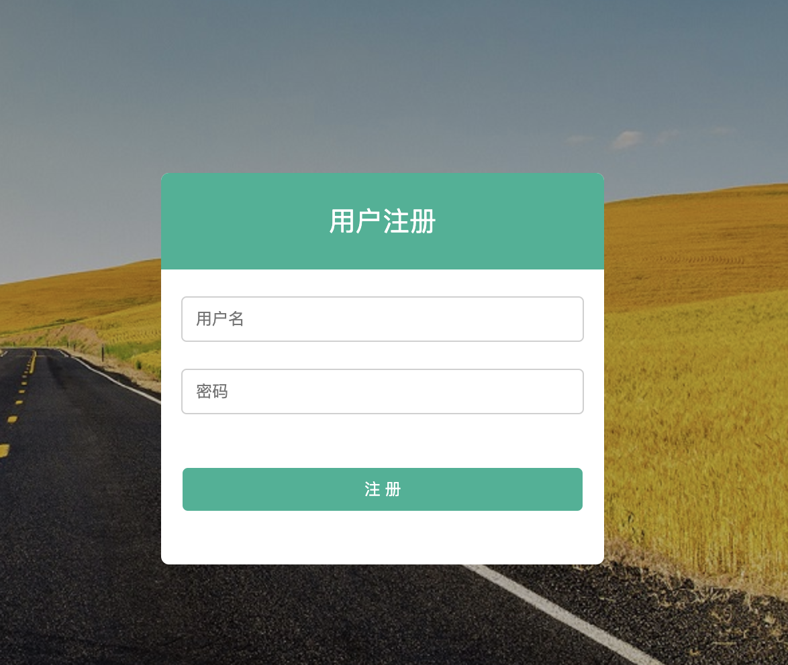

* 登陆界面

<http://192.168.236.177:30080/login>

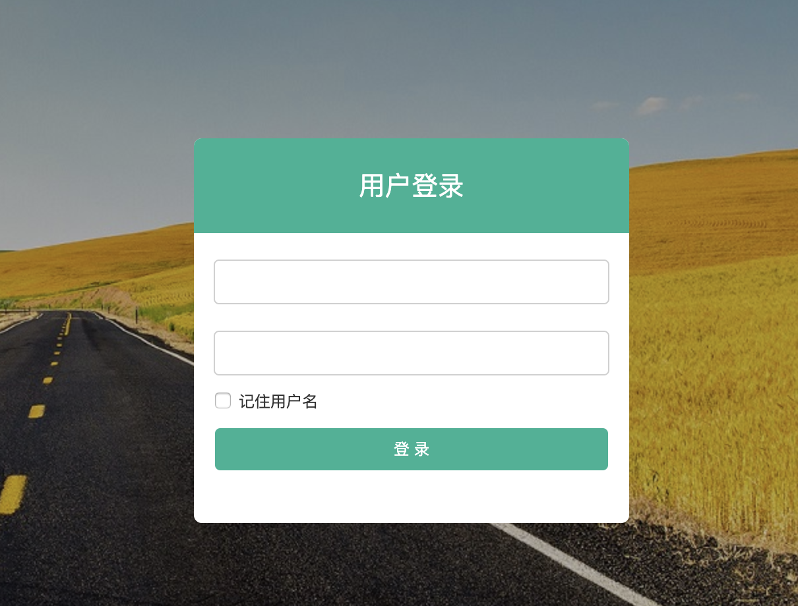


* 后端界面

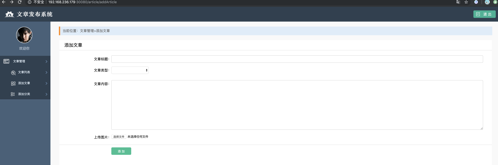


# 七、k8s架构图

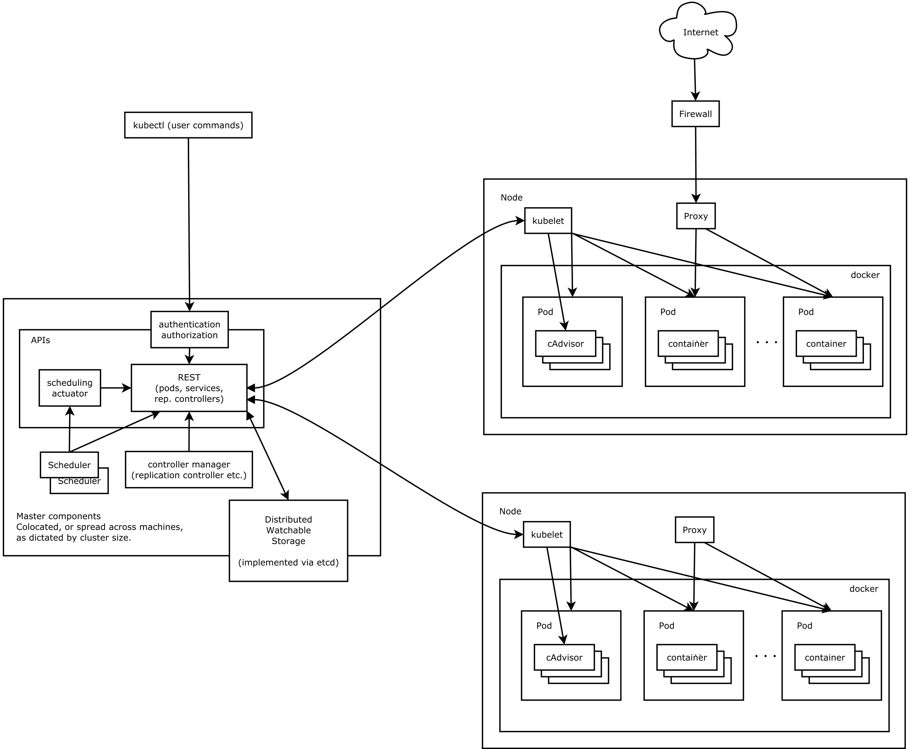